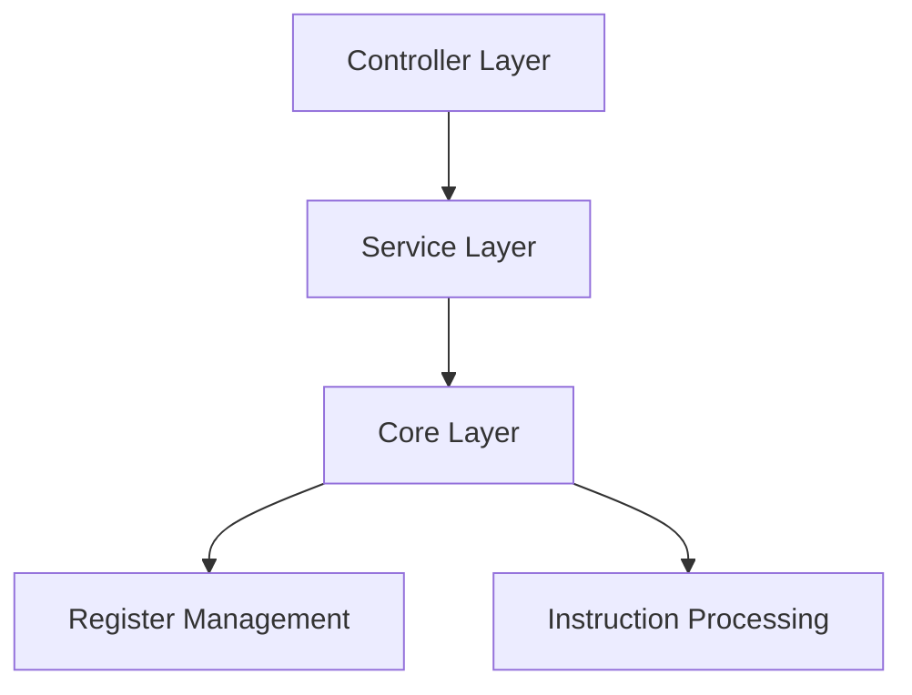

# Opcode Microprocessor Simulator

A Java Spring Boot application that simulates a custom microprocessor with a specific instruction set, providing a REST API interface for interaction.

## Project Development Approach

### Documentation-Driven Development
The project follows a documentation-driven development approach, with detailed documentation in the `docs/` directory that guided the implementation:

1. **Requirements (`docs/requirements/`)**
   - Detailed project requirements
   - Instruction set specifications
   - Core functionality expectations
   - Evaluation criteria

2. **Technical Specification (`docs/technical-spec/`)**
   - Comprehensive system design
   - Component architecture
   - Class diagrams and relationships
   - Error handling strategies
   - Testing approach

3. **Implementation Plan (`docs/implementation-plan/`)**
   - Structured, task-based approach
   - Six sequential implementation tasks:
     1. Core Domain Model Implementation
     2. Execute Single Instruction API
     3. Execute Batch Instructions API
     4. Register Value APIs
     5. Reset Processor API
     6. API Documentation and Final Integration
   - Each task builds upon previous work
   - Clear success criteria for each phase

4. **API Specification (`docs/api-spec/`)**
   - REST API endpoint definitions
   - Request/response formats
   - Error handling specifications

This documentation structure ensures:
- Clear understanding of requirements before implementation
- Well-thought-out technical design
- Structured, incremental development process
- Comprehensive API specifications

### Memory Bank System
This project utilizes a sophisticated Memory Bank system to maintain perfect documentation and context across development sessions. The Memory Bank consists of several key files:

1. **projectbrief.md**
   - Foundation document defining core requirements and goals
   - Outlines microprocessor specifications and instruction set
   - Defines implementation requirements and evaluation criteria

2. **productContext.md**
   - Explains why the project exists and problems it solves
   - Defines how the simulator should work
   - Outlines user experience goals and target users

3. **systemPatterns.md**
   - Documents system architecture and design patterns
   - Defines component relationships and processing pipeline
   - Outlines error handling and testing strategies

4. **techContext.md**
   - Details technologies used and development setup
   - Lists dependencies and tool usage patterns
   - Provides deployment considerations

5. **activeContext.md**
   - Tracks current work focus and recent changes
   - Documents active decisions and considerations
   - Records project insights and learnings

6. **progress.md**
   - Tracks what works and what's left to build
   - Documents current status and known issues
   - Records evolution of project decisions

### Cursor Rules
The project follows strict coding standards defined in `.cursor/rules/coding-standards.mdc`, ensuring:
- Clean, efficient Java and Spring Boot code
- Proper use of annotations and Spring Boot features
- Consistent naming conventions
- Comprehensive testing practices
- Security and performance considerations

## Technical Details

### Tech Stack
- Java 17
- Spring Boot 3.x
- Gradle
- JUnit 5
- Springdoc OpenAPI
- Lombok

### Project Structure
```
src/
├── main/
│   └── java/
│       └── com/
│           └── opcode/
│               ├── controller/    # REST API endpoints
│               ├── core/          # Core processor implementation
│               ├── exception/     # Custom exceptions
│               ├── instruction/   # Instruction implementations
│               ├── model/         # Request/Response models
│               ├── parser/        # Instruction parsing
│               └── service/       # Business logic
└── test/
    └── java/
        └── com/
            └── opcode/
                ├── controller/    # Controller tests
                ├── core/          # Core component tests
                ├── instruction/   # Instruction tests
                ├── integration/   # Integration tests
                ├── parser/        # Parser tests
                └── service/       # Service tests
```

### Instruction Set
| Instruction | Explanation       | Example         |
|-------------|-------------------|-----------------|
| SET A 10    | A = 10           | SET B -5        |
| ADR C D     | C = C + D        | ADR A B        |
| ADD A 12    | A = A + 12       | ADD C -3       |
| MOV A B     | A = B            | MOV D A        |
| INR C       | C = C + 1        | INR A          |
| DCR A       | A = A - 1        | DCR B          |
| RST         | All = 0          | RST            |

### API Endpoints

#### Execute Single Instruction
```bash
curl -X POST http://localhost:8080/api/v1/instructions \
  -H "Content-Type: application/json" \
  -d '{"instruction": "SET A 42"}'
```

#### Execute Batch Instructions
```bash
curl -X POST http://localhost:8080/api/v1/instructions/batch \
  -H "Content-Type: application/json" \
  -d '{
    "instructions": [
      "SET A 10",
      "SET B 20",
      "ADR A B"
    ]
  }'
```

#### Get All Register Values
```bash
curl -X GET http://localhost:8080/api/v1/registers
```

#### Get Specific Register Value
```bash
curl -X GET http://localhost:8080/api/v1/registers/A
```

#### Reset Processor
```bash
curl -X POST http://localhost:8080/api/v1/processor/reset
```

### Running Tests
```bash
./gradlew test
```

### Building and Running
```bash
# Build the project
./gradlew build

# Run the application
./gradlew bootRun
```

### Running the Application

1. **Prerequisites**
   - Java 17 or later
   - Gradle 7.x or later

2. **Clone the Repository**
   ```bash
   git clone <repository-url>
   cd opcode-sample
   ```

3. **Build and Run**
   ```bash
   # Build the project
   ./gradlew build

   # Run the application
   ./gradlew bootRun
   ```

   The application will start on `http://localhost:8080`

### API Documentation

The project uses Springdoc OpenAPI for API documentation. Once the application is running, you can access:

1. **Swagger UI**
   ```
   http://localhost:8080/swagger-ui.html
   ```
   - Interactive API documentation
   - Test API endpoints directly from the browser
   - View request/response schemas
   - Try out different instruction combinations

2. **OpenAPI Specification**
   ```
   http://localhost:8080/v3/api-docs
   ```
   - Raw OpenAPI specification in JSON format
   - Can be imported into API tools like Postman
   - Complete API schema and endpoint definitions

3. **OpenAPI YAML**
   ```
   http://localhost:8080/v3/api-docs.yaml
   ```
   - YAML version of the OpenAPI specification
   - Human-readable format
   - Useful for API documentation tools

## Architecture

The application follows a layered architecture with clear separation of concerns:



### Key Design Patterns
- **Command Pattern**: Each instruction is implemented as a command
- **Factory Pattern**: Centralized instruction creation
- **Facade Pattern**: Processor class simplifies client interaction
- **Registry Pattern**: RegisterManager handles centralized state

### Error Handling
- Custom exception hierarchy for different error types
- Consistent HTTP status codes
- Informative error messages
- Global exception handling

## Contributing
1. Fork the repository
2. Create a feature branch
3. Commit your changes
4. Push to the branch
5. Create a Pull Request

## License
[MIT License](LICENSE)
