# High-Level Design (HLD) - Opcode Microprocessor Simulator

## Document Information
- **Version**: 1.0
- **Date**: January 5, 2025
- **Status**: Final
- **Author**: System Architecture Team
- **Project**: Opcode Microprocessor Simulator

---

## Table of Contents
1. [Introduction](#1-introduction)
2. [System Overview](#2-system-overview)
3. [Functional Requirements](#3-functional-requirements)
4. [Non-Functional Requirements](#4-non-functional-requirements)
5. [High-Level Architecture](#5-high-level-architecture)
6. [Component/Module Breakdown](#6-componentmodule-breakdown)
7. [Sequence Diagrams & Workflow Flows](#7-sequence-diagrams--workflow-flows)
8. [Database & Queue Design](#8-database--queue-design)
9. [API Contracts](#9-api-contracts)
10. [Technology Stack](#10-technology-stack)
11. [Security Considerations](#11-security-considerations)
12. [Scalability & Performance](#12-scalability--performance)
13. [Monitoring & Observability](#13-monitoring--observability)
14. [Deployment Architecture](#14-deployment-architecture)
15. [Risk Assessment](#15-risk-assessment)

---

## 1. Introduction

### 1.1 Purpose
The Opcode Microprocessor Simulator is a REST API-based system that simulates the behavior of a custom microprocessor with a specific instruction set. This document provides the high-level design and architecture for the system.

### 1.2 Scope
This HLD covers the complete system architecture including:
- RESTful API design
- Core simulation engine
- Instruction processing pipeline
- Register management
- Error handling and validation
- Testing and deployment strategies

### 1.3 Business Context
The system serves as a prototype for a custom microprocessor instruction set, enabling:
- Educational demonstrations of microprocessor concepts
- Interview assessment tool for software engineering candidates
- Foundation for future microprocessor simulation enhancements

### 1.4 Key Stakeholders
- **Development Team**: Implementation and maintenance
- **Interview Panel**: Assessment tool usage
- **Candidates**: System demonstration and evaluation
- **Educational Users**: Learning microprocessor concepts

---

## 2. System Overview

### 2.1 System Description
The Opcode Microprocessor Simulator is a Spring Boot-based REST API that simulates a custom microprocessor with:
- **4 Registers**: A, B, C, D (32-bit signed integers)
- **7 Instructions**: SET, ADR, ADD, MOV, INR, DCR, RST
- **RESTful Interface**: HTTP-based API for instruction execution
- **Real-time Processing**: Immediate instruction execution and response

### 2.2 System Boundaries
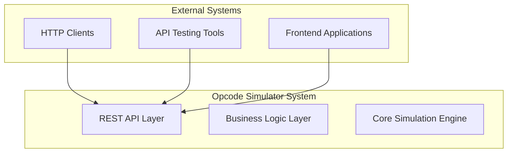

### 2.3 Key Features
- **Single Instruction Execution**: Execute individual microprocessor instructions
- **Batch Instruction Processing**: Execute multiple instructions sequentially
- **Register State Management**: Query and monitor register values
- **Processor Reset**: Reset all registers to initial state
- **Comprehensive Error Handling**: Detailed error responses for invalid operations
- **API Documentation**: OpenAPI/Swagger documentation

---

## 3. Functional Requirements

### 3.1 Core Functional Requirements

| Requirement ID | Description | Priority |
|----------------|-------------|----------|
| FR-001 | Execute single instruction via REST API | High |
| FR-002 | Execute batch instructions via REST API | High |
| FR-003 | Query individual register values | High |
| FR-004 | Query all register values | High |
| FR-005 | Reset processor state | High |
| FR-006 | Validate instruction syntax | High |
| FR-007 | Handle invalid register references | High |
| FR-008 | Support all 7 instruction types | High |
| FR-009 | Maintain register state across requests | High |
| FR-010 | Provide detailed error messages | Medium |

### 3.2 Instruction Set Requirements

| Instruction | Format | Description | Example |
|-------------|--------|-------------|---------|
| SET | SET {register} {value} | Set register to value | SET A 10 |
| ADR | ADR {reg1} {reg2} | Add reg2 to reg1 | ADR C D |
| ADD | ADD {register} {value} | Add value to register | ADD A 12 |
| MOV | MOV {reg1} {reg2} | Copy reg2 to reg1 | MOV A B |
| INR | INR {register} | Increment register | INR C |
| DCR | DCR {register} | Decrement register | DCR A |
| RST | RST | Reset all registers | RST |

### 3.3 API Functional Requirements

| Endpoint | Method | Description |
|----------|--------|-------------|
| `/api/v1/instructions` | POST | Execute single instruction |
| `/api/v1/instructions/batch` | POST | Execute batch instructions |
| `/api/v1/registers` | GET | Get all register values |
| `/api/v1/registers/{register}` | GET | Get specific register value |
| `/api/v1/processor/reset` | POST | Reset processor state |

---

## 4. Non-Functional Requirements

### 4.1 Performance Requirements

| Requirement | Target | Measurement |
|-------------|--------|-------------|
| Response Time | < 100ms | 95th percentile for single instruction |
| Throughput | > 1000 req/sec | Concurrent instruction execution |
| Batch Processing | < 10ms per instruction | For batch operations |
| Memory Usage | < 512MB | JVM heap usage |
| CPU Utilization | < 50% | Under normal load |

### 4.2 Reliability Requirements

| Requirement | Target | Description |
|-------------|--------|-------------|
| Availability | 99.9% | System uptime |
| Error Rate | < 0.1% | For valid requests |
| Recovery Time | < 30 seconds | From system failures |
| Data Consistency | 100% | Register state accuracy |

### 4.3 Scalability Requirements

| Requirement | Target | Description |
|-------------|--------|-------------|
| Concurrent Users | 100+ | Simultaneous API users |
| Horizontal Scaling | Stateless design | Support load balancing |
| Vertical Scaling | 4+ CPU cores | Efficient resource utilization |

### 4.4 Security Requirements

| Requirement | Description |
|-------------|-------------|
| Input Validation | Comprehensive validation of all inputs |
| Error Handling | No sensitive information in error responses |
| Rate Limiting | Protection against abuse |
| HTTPS Support | Secure communication |

### 4.5 Maintainability Requirements

| Requirement | Description |
|-------------|-------------|
| Code Coverage | > 90% unit test coverage |
| Documentation | Comprehensive API and code documentation |
| Logging | Structured logging for debugging |
| Monitoring | Health checks and metrics |

---

## 5. High-Level Architecture

### 5.1 System Architecture Overview

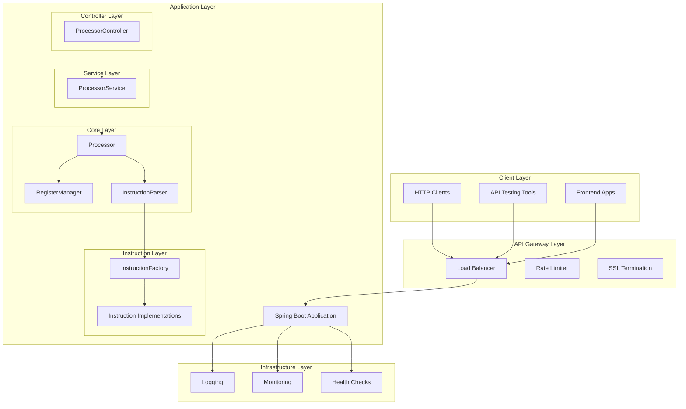

### 5.2 Architectural Patterns

#### 5.2.1 Layered Architecture
- **Presentation Layer**: REST Controllers
- **Business Layer**: Service classes
- **Core Layer**: Domain logic and entities
- **Infrastructure Layer**: Cross-cutting concerns

#### 5.2.2 Design Patterns Used
- **Command Pattern**: Instruction implementations
- **Factory Pattern**: Instruction creation
- **Facade Pattern**: Processor as system facade
- **Strategy Pattern**: Instruction execution strategies
- **Dependency Injection**: Spring IoC container

### 5.3 Architectural Principles

| Principle | Implementation |
|-----------|----------------|
| **Separation of Concerns** | Clear layer boundaries |
| **Single Responsibility** | Each class has one purpose |
| **Open/Closed Principle** | Extensible instruction set |
| **Dependency Inversion** | Interface-based design |
| **DRY (Don't Repeat Yourself)** | Shared abstractions |

---

## 6. Component/Module Breakdown

### 6.1 Controller Layer

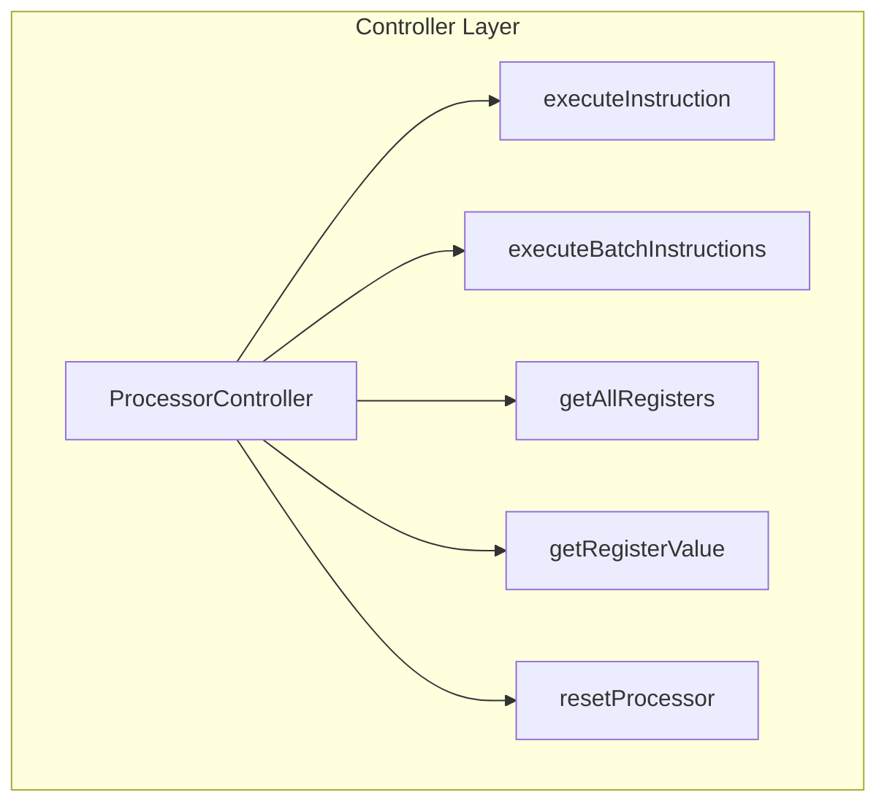

**Responsibilities:**
- HTTP request/response handling
- Input validation
- Error response formatting
- API documentation annotations

### 6.2 Service Layer

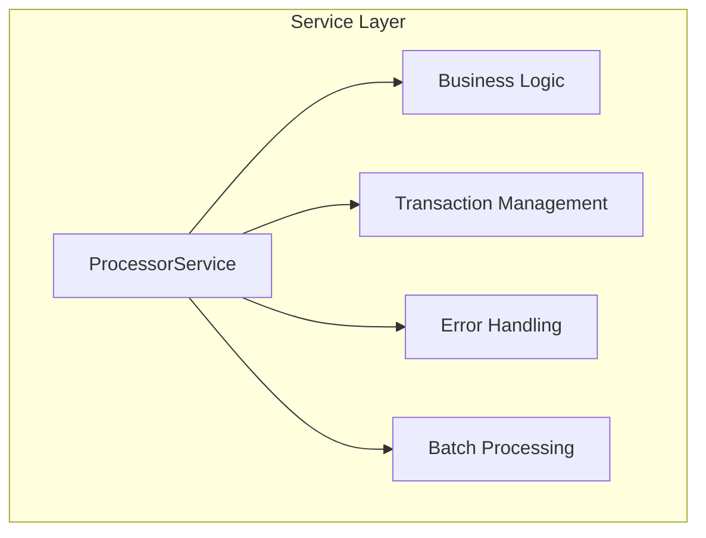

**Responsibilities:**
- Business logic orchestration
- Batch instruction processing
- Error handling and recovery
- Service-level validations

### 6.3 Core Layer

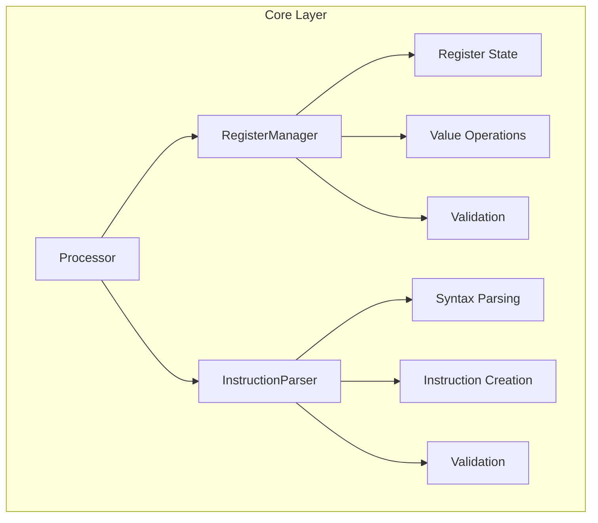

**Responsibilities:**
- Core simulation logic
- Register state management
- Instruction parsing and validation
- System facade operations

### 6.4 Instruction Layer

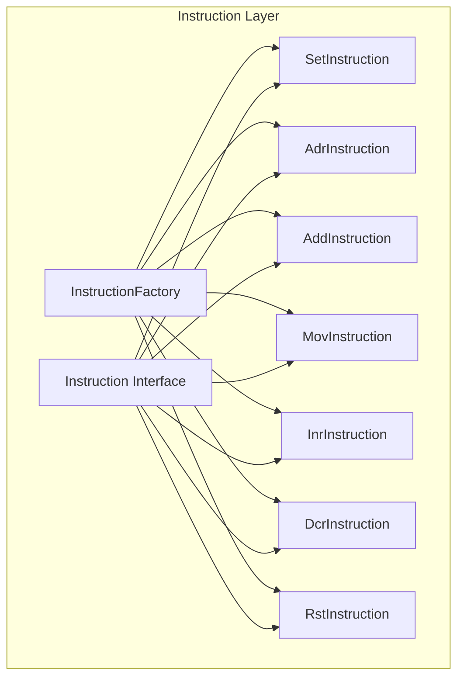

**Responsibilities:**
- Instruction creation and instantiation
- Individual instruction execution logic
- Instruction-specific validations
- Extensible instruction framework

### 6.5 Exception Handling Layer

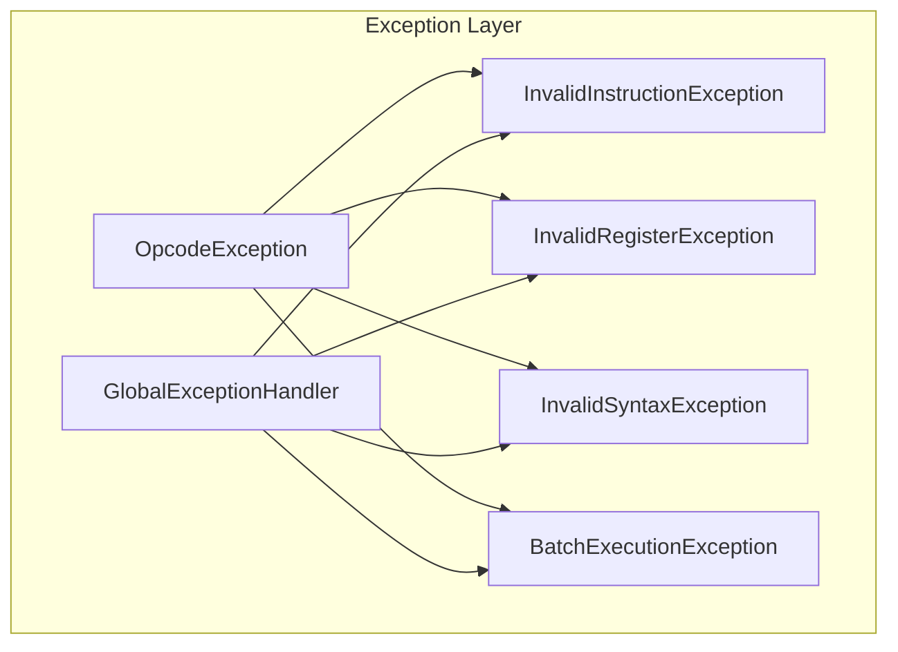

**Responsibilities:**
- Centralized exception handling
- Error response standardization
- Logging and monitoring integration
- User-friendly error messages

---

## 7. Sequence Diagrams & Workflow Flows

### 7.1 Single Instruction Execution Flow

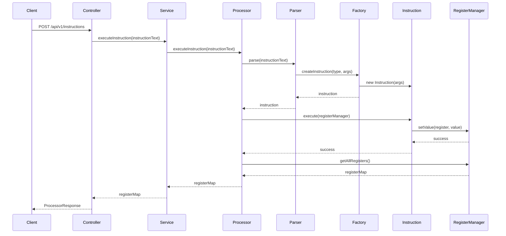

### 7.2 Batch Instruction Execution Flow

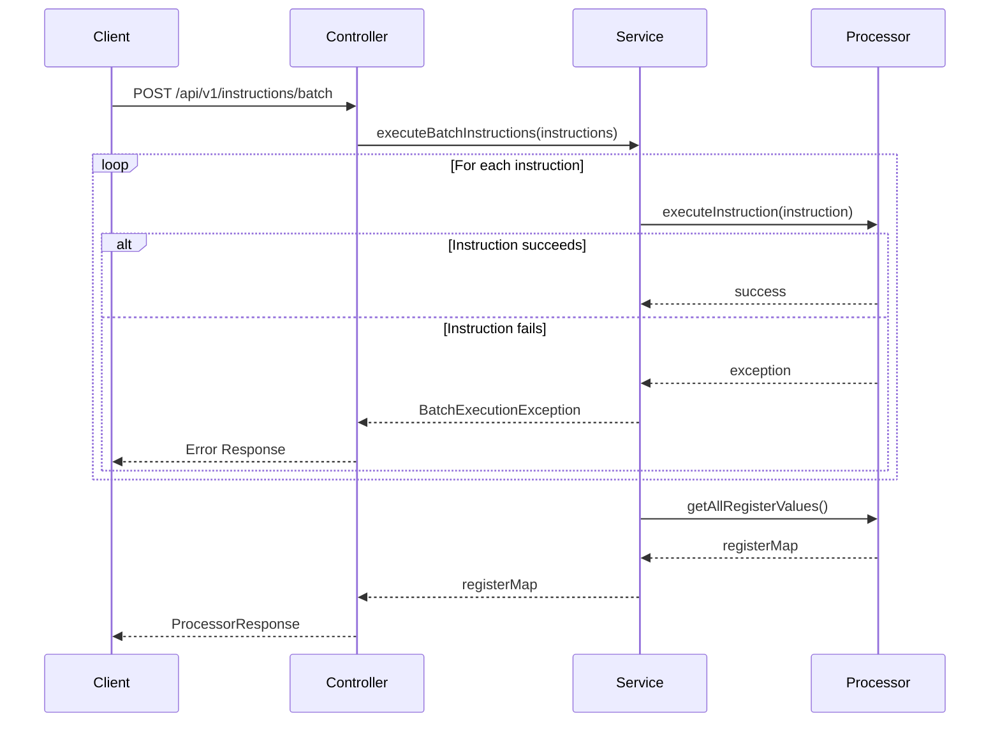

### 7.3 Register Query Flow

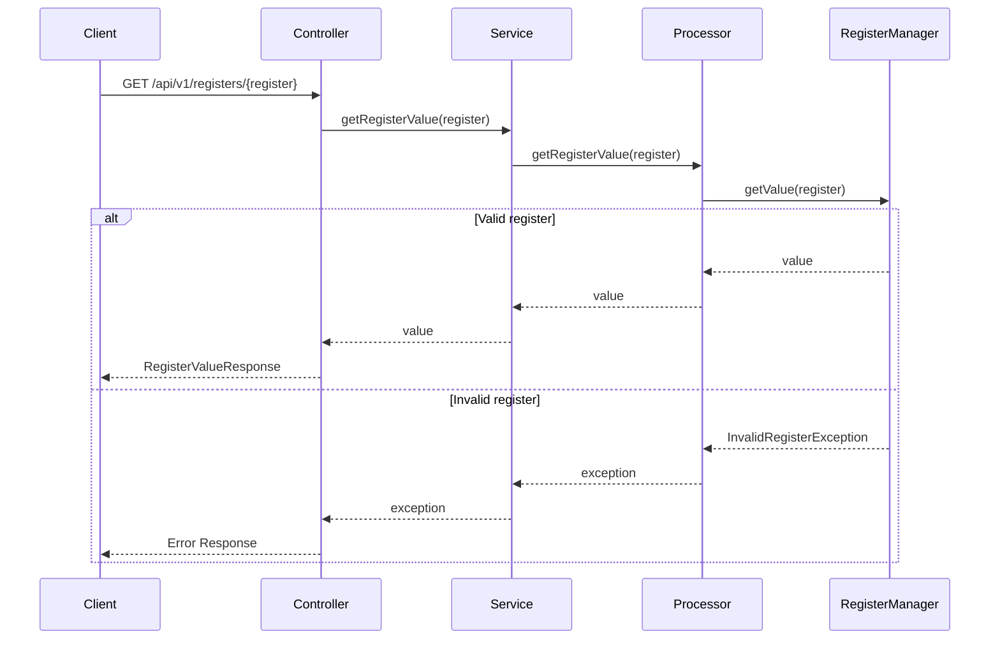

### 7.4 Processor Reset Flow

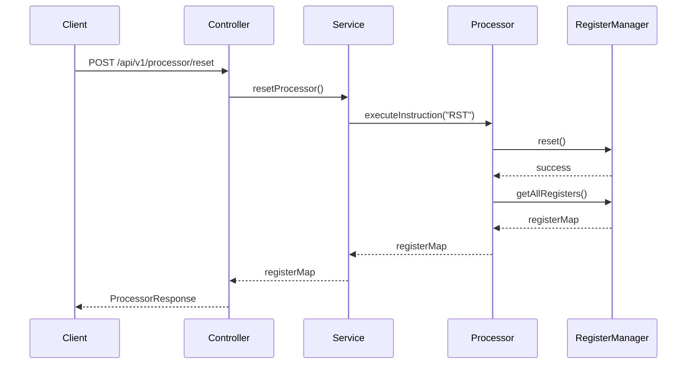

---

## 8. Database & Queue Design

### 8.1 Database Requirements

**Current Implementation:**
- **Type**: In-Memory Storage
- **Scope**: Single JVM instance
- **Persistence**: None (stateless across restarts)
- **Concurrency**: Thread-safe operations

### 8.2 Future Database Considerations

**For Production/Scalable Implementation:**

| Database Type | Use Case | Justification |
|---------------|----------|---------------|
| **Redis** | Session state storage | Fast in-memory operations, persistence options |
| **PostgreSQL** | Audit logs, instruction history | ACID compliance, complex queries |
| **H2** | Development/Testing | Embedded, lightweight |

### 8.3 Queue Design

**Current Implementation:**
- **Type**: Synchronous processing
- **Scope**: Direct method calls
- **Concurrency**: Single-threaded per request

**Future Queue Considerations:**

| Queue Type | Use Case | Benefits |
|------------|----------|----------|
| **RabbitMQ** | Async instruction processing | Reliability, message persistence |
| **Apache Kafka** | Event streaming, audit trail | High throughput, event sourcing |
| **Redis Pub/Sub** | Real-time notifications | Low latency, simple setup |

---

## 9. API Contracts

### 9.1 Request/Response Models

#### 9.1.1 Single Instruction Execution

**Request:**
```json
POST /api/v1/instructions
Content-Type: application/json

{
  "instruction": "SET A 10"
}
```

**Response:**
```json
HTTP 200 OK
Content-Type: application/json

{
  "success": true,
  "message": "Instruction executed successfully",
  "registers": {
    "A": 10,
    "B": 0,
    "C": 0,
    "D": 0
  },
  "timestamp": "2025-01-05T18:30:00Z"
}
```

#### 9.1.2 Batch Instruction Execution

**Request:**
```json
POST /api/v1/instructions/batch
Content-Type: application/json

{
  "instructions": [
    "SET A 10",
    "SET B 20",
    "ADR A B"
  ]
}
```

**Response:**
```json
HTTP 200 OK
Content-Type: application/json

{
  "success": true,
  "message": "All instructions executed successfully",
  "registers": {
    "A": 30,
    "B": 20,
    "C": 0,
    "D": 0
  },
  "timestamp": "2025-01-05T18:30:00Z"
}
```

#### 9.1.3 Register Value Query

**Request:**
```json
GET /api/v1/registers/A
```

**Response:**
```json
HTTP 200 OK
Content-Type: application/json

{
  "value": 30
}
```

#### 9.1.4 All Registers Query

**Request:**
```json
GET /api/v1/registers
```

**Response:**
```json
HTTP 200 OK
Content-Type: application/json

{
  "A": 30,
  "B": 20,
  "C": 0,
  "D": 0
}
```

#### 9.1.5 Processor Reset

**Request:**
```json
POST /api/v1/processor/reset
```

**Response:**
```json
HTTP 200 OK
Content-Type: application/json

{
  "success": true,
  "message": "Processor reset successfully",
  "registers": {
    "A": 0,
    "B": 0,
    "C": 0,
    "D": 0
  },
  "timestamp": "2025-01-05T18:30:00Z"
}
```

### 9.2 Error Response Models

#### 9.2.1 Invalid Instruction Syntax

```json
HTTP 400 Bad Request
Content-Type: application/json

{
  "success": false,
  "error": "INVALID_SYNTAX",
  "message": "Invalid instruction syntax: INVALID_COMMAND",
  "timestamp": "2025-01-05T18:30:00Z"
}
```

#### 9.2.2 Invalid Register

```json
HTTP 404 Not Found
Content-Type: application/json

{
  "success": false,
  "error": "INVALID_REGISTER",
  "message": "Invalid register: X",
  "timestamp": "2025-01-05T18:30:00Z"
}
```

#### 9.2.3 Batch Execution Error

```json
HTTP 400 Bad Request
Content-Type: application/json

{
  "success": false,
  "error": "BATCH_EXECUTION_ERROR",
  "message": "Error executing instruction: INVALID_COMMAND - Invalid instruction syntax",
  "executedCount": 2,
  "timestamp": "2025-01-05T18:30:00Z"
}
```

### 9.3 OpenAPI Specification

The system provides comprehensive OpenAPI 3.0 documentation accessible at:
- **Swagger UI**: `/swagger-ui.html`
- **OpenAPI JSON**: `/v3/api-docs`
- **OpenAPI YAML**: `/v3/api-docs.yaml`

---

## 10. Technology Stack

### 10.1 Core Technologies

| Component | Technology | Version | Justification |
|-----------|------------|---------|---------------|
| **Runtime** | Java | 17+ | LTS version, modern features |
| **Framework** | Spring Boot | 3.1.0+ | Rapid development, production-ready |
| **Build Tool** | Gradle | 8.0+ | Flexible, powerful build automation |
| **Testing** | JUnit | 5.9+ | Modern testing framework |
| **Documentation** | SpringDoc OpenAPI | 2.0+ | API documentation generation |

### 10.2 Spring Boot Dependencies

```gradle
dependencies {
    implementation 'org.springframework.boot:spring-boot-starter-web'
    implementation 'org.springframework.boot:spring-boot-starter-validation'
    implementation 'org.springframework.boot:spring-boot-starter-actuator'
    implementation 'org.springdoc:springdoc-openapi-starter-webmvc-ui'
    
    testImplementation 'org.springframework.boot:spring-boot-starter-test'
    testImplementation 'org.springframework.boot:spring-boot-testcontainers'
}
```

### 10.3 Development Tools

| Tool | Purpose | Version |
|------|---------|---------|
| **IDE** | IntelliJ IDEA / VS Code | Latest |
| **Version Control** | Git | 2.40+ |
| **API Testing** | Postman / Insomnia | Latest |
| **Code Quality** | SonarQube | 9.0+ |
| **CI/CD** | GitHub Actions / Jenkins | Latest |

---

## 11. Security Considerations

### 11.1 Current Security Measures

| Security Aspect | Implementation | Status |
|-----------------|----------------|--------|
| **Input Validation** | Bean Validation annotations | ✅ Implemented |
| **Error Handling** | Global exception handler | ✅ Implemented |
| **HTTPS** | SSL/TLS configuration | 🔄 Configurable |
| **CORS** | Cross-origin configuration | 🔄 Configurable |

### 11.2 Future Security Enhancements

| Enhancement | Priority | Description |
|-------------|----------|-------------|
| **Authentication** | Medium | JWT-based authentication |
| **Authorization** | Medium | Role-based access control |
| **Rate Limiting** | High | Request throttling |
| **Input Sanitization** | High | Advanced input validation |
| **Audit Logging** | Medium | Security event logging |

### 11.3 Security Best Practices

- **Principle of Least Privilege**: Minimal required permissions
- **Defense in Depth**: Multiple security layers
- **Secure by Default**: Secure default configurations
- **Regular Updates**: Keep dependencies updated
- **Security Testing**: Regular vulnerability assessments

---

## 12. Scalability & Performance

### 12.1 Current Performance Characteristics

| Metric | Current | Target | Notes |
|--------|---------|--------|-------|
| **Response Time** | ~50ms | <100ms | Single instruction |
| **Throughput** | ~500 req/s | >1000 req/s | Concurrent requests |
| **Memory Usage** | ~256MB | <512MB | JVM heap |
| **CPU Usage** | ~25% | <50% | Under load |

### 12.2 Scalability Strategies

#### 12.2.1 Horizontal Scaling
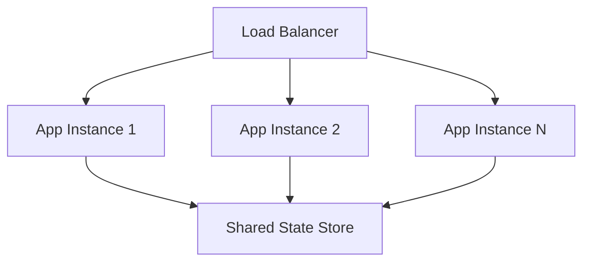

#### 12.2.2 Vertical Scaling
- **CPU**: Multi-core processing
- **Memory**: Increased heap size
- **Storage**: SSD for faster I/O

### 12.3 Performance Optimization

| Optimization | Impact | Implementation |
|--------------|--------|----------------|
| **Connection Pooling** | High | Database connections |
| **Caching** | Medium | Register state caching |
| **Async Processing** | Medium | Non-blocking operations |
| **JVM Tuning** | Low | Garbage collection optimization |

---

## 13. Monitoring & Observability

### 13.1 Health Checks

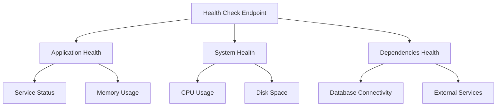

### 13.2 Metrics Collection

| Metric Type | Examples | Tools |
|-------------|----------|-------|
| **Application** | Request count, response time | Micrometer |
| **System** | CPU, memory, disk | Actuator |
| **Business** | Instructions executed | Custom metrics |
| **Error** | Exception rates | Logging framework |

### 13.3 Logging Strategy

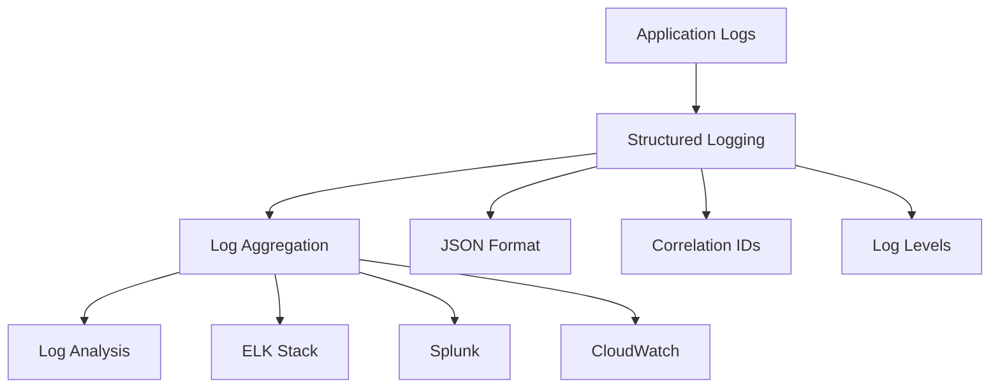

### 13.4 Alerting

| Alert Type | Condition | Action |
|------------|-----------|--------|
| **High Error Rate** | >5% error rate | Immediate notification |
| **High Response Time** | >500ms average | Warning notification |
| **Memory Usage** | >80% heap usage | Warning notification |
| **Service Down** | Health check failure | Immediate notification |

---

## 14. Deployment Architecture

### 14.1 Deployment Environments

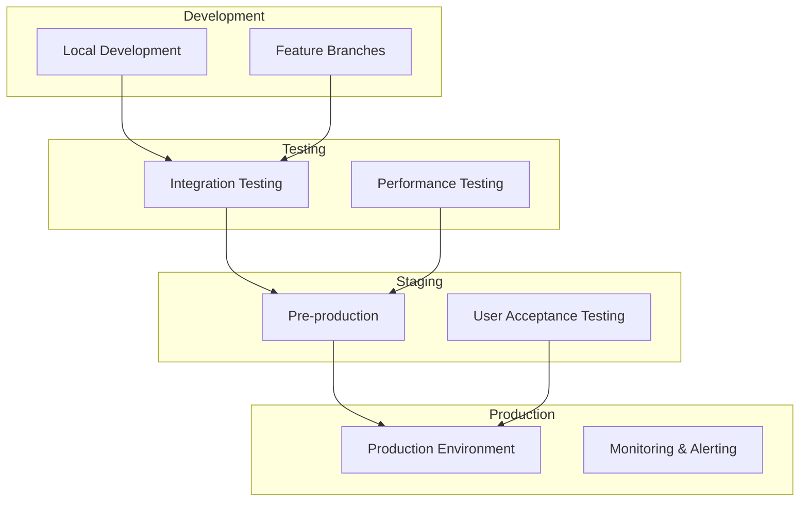

### 14.2 Container Strategy

**Docker Configuration:**
```dockerfile
FROM openjdk:17-jre-slim
COPY target/opcode-simulator.jar app.jar
EXPOSE 8080
ENTRYPOINT ["java", "-jar", "/app.jar"]
```

**Kubernetes Deployment:**
```yaml
apiVersion: apps/v1
kind: Deployment
metadata:
  name: opcode-simulator
spec:
  replicas: 3
  selector:
    matchLabels:
      app: opcode-simulator
  template:
    metadata:
      labels:
        app: opcode-simulator
    spec:
      containers:
      - name: opcode-simulator
        image: opcode-simulator:latest
        ports:
        - containerPort: 8080
```

### 14.3 CI/CD Pipeline

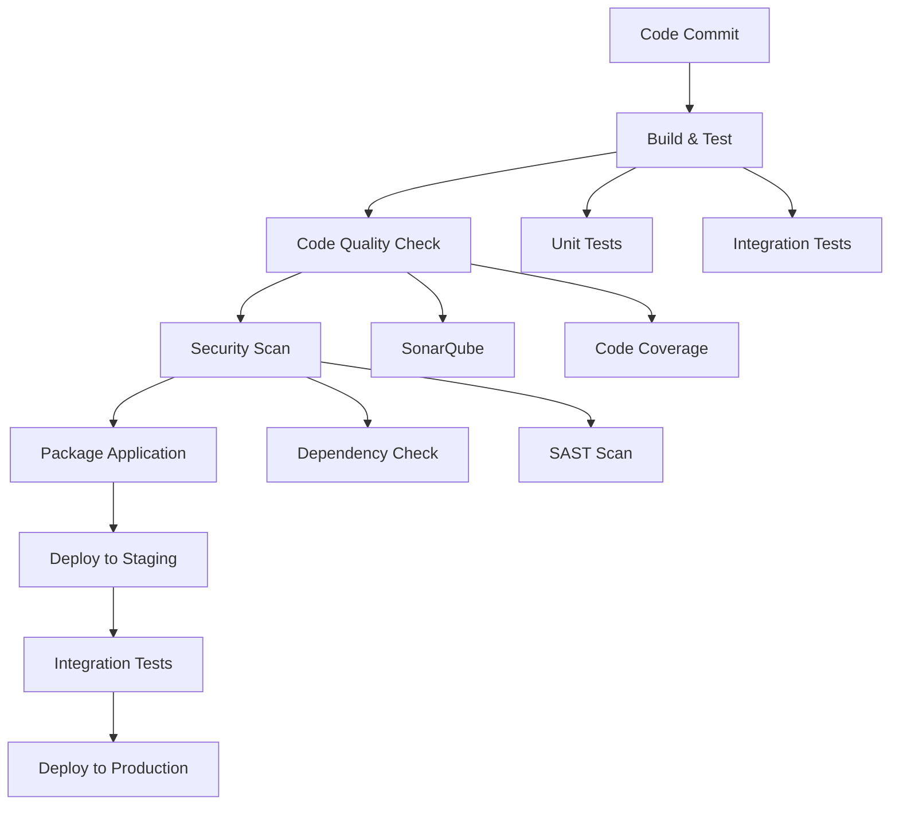

---

## 15. Risk Assessment

### 15.1 Technical Risks

| Risk | Probability | Impact | Mitigation |
|------|-------------|--------|------------|
| **Memory Leaks** | Low | High | Comprehensive testing, monitoring |
| **Concurrency Issues** | Medium | High | Thread-safe implementations |
| **Performance Degradation** | Medium | Medium | Load testing, optimization |
| **Security Vulnerabilities** | Low | High | Security testing, updates |

### 15.2 Operational Risks

| Risk | Probability | Impact | Mitigation |
|------|-------------|--------|------------|
| **Service Downtime** | Low | High | High availability setup |
| **Data Loss** | Very Low | Medium | Backup strategies |
| **Scaling Issues** | Medium | Medium | Auto-scaling configuration |
| **Monitoring Gaps** | Medium | Low | Comprehensive monitoring |

### 15.3 Business Risks

| Risk | Probability | Impact | Mitigation |
|------|-------------|--------|------------|
| **Requirements Change** | High | Low | Flexible architecture |
| **Timeline Pressure** | Medium | Medium | Agile development |
| **Resource Constraints** | Low | Medium | Efficient resource usage |
| **Technology Obsolescence** | Low | Low | Modern technology stack |

### 15.4 Risk Monitoring

- **Regular Risk Reviews**: Monthly assessment
- **Automated Monitoring**: Continuous system monitoring
- **Incident Response**: Defined escalation procedures
- **Business Continuity**: Disaster recovery planning

---

## Conclusion

This High-Level Design document provides a comprehensive architectural overview of the Opcode Microprocessor Simulator. The design emphasizes:

- **Modularity**: Clear separation of concerns
- **Extensibility**: Easy addition of new instructions and features
- **Reliability**: Robust error handling and monitoring
- **Performance**: Optimized for high throughput and low latency
- **Maintainability**: Clean code and comprehensive documentation

The architecture supports both current requirements and future enhancements, making it suitable for educational purposes, interview assessments, and potential production deployments.

---

**Document Control:**
- **Next Review Date**: February 5, 2025
- **Approval Required**: Technical Lead, Architecture Team
- **Distribution**: Development Team, Stakeholders
