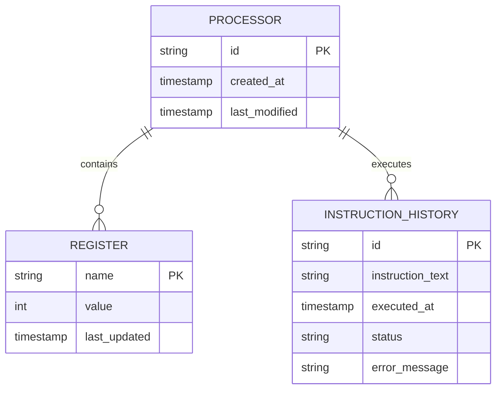
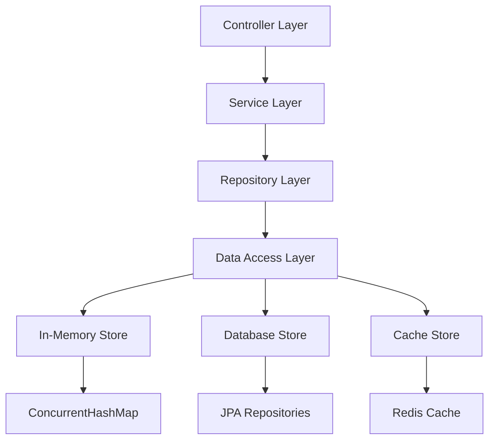
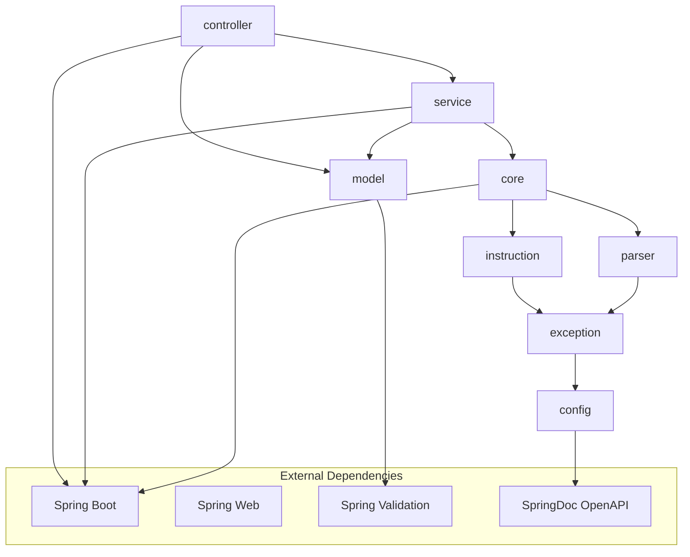

# Low-Level Design (LLD) - Opcode Microprocessor Simulator

## Document Information
- **Version**: 1.0
- **Date**: January 5, 2025
- **Status**: Final
- **Author**: Development Team
- **Project**: Opcode Microprocessor Simulator

---

## Table of Contents
1. [Introduction](#1-introduction)
2. [Data Model & Database Design](#2-data-model--database-design)
3. [Technology & Frameworks](#3-technology--frameworks)
4. [Package & Module Structure](#4-package--module-structure)
5. [Component & Class-Level Design](#5-component--class-level-design)
6. [Data Structures & Schemas](#6-data-structures--schemas)
7. [Entity Relationship Diagram (ERD)](#7-entity-relationship-diagram-erd)
8. [In-Memory Data Structures](#8-in-memory-data-structures)
9. [Class Diagrams](#9-class-diagrams)
10. [Configuration & Environment Details](#10-configuration--environment-details)
11. [Testing Strategy](#11-testing-strategy)
12. [Deployment & Build Details](#12-deployment--build-details)
13. [Performance Considerations](#13-performance-considerations)
14. [Security Implementation](#14-security-implementation)
15. [Error Handling & Logging](#15-error-handling--logging)

---

## 1. Introduction

### 1.1 Purpose
This Low-Level Design document provides detailed implementation specifications for the Opcode Microprocessor Simulator, including class structures, data models, algorithms, and technical implementation details.

### 1.2 Scope
This LLD covers:
- Detailed class and interface designs
- Data structures and algorithms
- Implementation patterns and best practices
- Configuration and deployment specifications
- Testing strategies and frameworks

### 1.3 Design Principles
- **SOLID Principles**: Single Responsibility, Open/Closed, Liskov Substitution, Interface Segregation, Dependency Inversion
- **DRY (Don't Repeat Yourself)**: Eliminate code duplication
- **KISS (Keep It Simple, Stupid)**: Maintain simplicity in design
- **YAGNI (You Aren't Gonna Need It)**: Implement only required features

---

## 2. Data Model & Database Design

### 2.1 Current Data Model

**In-Memory Storage Model:**


### 2.2 Future Database Schema

**For Persistent Storage (PostgreSQL):**

```sql
-- Processor Sessions Table
CREATE TABLE processor_sessions (
    id UUID PRIMARY KEY DEFAULT gen_random_uuid(),
    session_name VARCHAR(255),
    created_at TIMESTAMP DEFAULT CURRENT_TIMESTAMP,
    last_accessed TIMESTAMP DEFAULT CURRENT_TIMESTAMP,
    is_active BOOLEAN DEFAULT true
);

-- Register States Table
CREATE TABLE register_states (
    id UUID PRIMARY KEY DEFAULT gen_random_uuid(),
    session_id UUID REFERENCES processor_sessions(id),
    register_name VARCHAR(1) NOT NULL CHECK (register_name IN ('A', 'B', 'C', 'D')),
    register_value INTEGER NOT NULL,
    updated_at TIMESTAMP DEFAULT CURRENT_TIMESTAMP,
    UNIQUE(session_id, register_name)
);

-- Instruction History Table
CREATE TABLE instruction_history (
    id UUID PRIMARY KEY DEFAULT gen_random_uuid(),
    session_id UUID REFERENCES processor_sessions(id),
    instruction_text VARCHAR(255) NOT NULL,
    instruction_type VARCHAR(10) NOT NULL,
    executed_at TIMESTAMP DEFAULT CURRENT_TIMESTAMP,
    execution_status VARCHAR(20) DEFAULT 'SUCCESS',
    error_message TEXT,
    execution_time_ms INTEGER
);

-- Indexes for performance
CREATE INDEX idx_register_states_session ON register_states(session_id);
CREATE INDEX idx_instruction_history_session ON instruction_history(session_id);
CREATE INDEX idx_instruction_history_executed_at ON instruction_history(executed_at);
```

### 2.3 Data Access Patterns



---

## 3. Technology & Frameworks

### 3.1 Core Technology Stack

| Component | Technology | Version | Purpose |
|-----------|------------|---------|---------|
| **Runtime** | OpenJDK | 17+ | Java runtime environment |
| **Framework** | Spring Boot | 3.1.0+ | Application framework |
| **Build Tool** | Gradle | 8.0+ | Build automation |
| **Testing** | JUnit Jupiter | 5.9+ | Unit testing framework |
| **Mocking** | Mockito | 5.0+ | Mock object framework |
| **Validation** | Hibernate Validator | 8.0+ | Bean validation |
| **Documentation** | SpringDoc OpenAPI | 2.0+ | API documentation |
| **Logging** | Logback | 1.4+ | Logging framework |

### 3.2 Spring Boot Starters

```gradle
dependencies {
    // Core Spring Boot starters
    implementation 'org.springframework.boot:spring-boot-starter-web'
    implementation 'org.springframework.boot:spring-boot-starter-validation'
    implementation 'org.springframework.boot:spring-boot-starter-actuator'
    
    // API Documentation
    implementation 'org.springdoc:springdoc-openapi-starter-webmvc-ui:2.0.2'
    
    // Testing
    testImplementation 'org.springframework.boot:spring-boot-starter-test'
    testImplementation 'org.springframework.boot:spring-boot-testcontainers'
    testImplementation 'org.testcontainers:junit-jupiter'
    
    // Development tools
    developmentOnly 'org.springframework.boot:spring-boot-devtools'
    annotationProcessor 'org.springframework.boot:spring-boot-configuration-processor'
}
```

### 3.3 Java 17 Features Utilized

| Feature | Usage | Benefit |
|---------|-------|---------|
| **Records** | Data transfer objects | Immutable data carriers |
| **Pattern Matching** | Switch expressions | Cleaner conditional logic |
| **Text Blocks** | Multi-line strings | Better readability |
| **Sealed Classes** | Exception hierarchy | Controlled inheritance |
| **var keyword** | Local variables | Type inference |

---

## 4. Package & Module Structure

### 4.1 Package Organization

```
com.opcode/
├── OpcodeSampleApplication.java          # Main application class
├── controller/                           # REST controllers
│   └── ProcessorController.java
├── service/                             # Business logic layer
│   └── ProcessorService.java
├── core/                                # Core domain logic
│   ├── Processor.java
│   ├── RegisterManager.java
│   ├── Register.java
│   └── RegisterName.java
├── instruction/                         # Instruction implementations
│   ├── Instruction.java
│   ├── AbstractInstruction.java
│   ├── InstructionFactory.java
│   ├── SetInstruction.java
│   ├── AdrInstruction.java
│   ├── AddInstruction.java
│   ├── MovInstruction.java
│   ├── InrInstruction.java
│   ├── DcrInstruction.java
│   └── RstInstruction.java
├── parser/                              # Instruction parsing
│   └── InstructionParser.java
├── model/                               # Data transfer objects
│   ├── ApiResponse.java
│   ├── InstructionRequest.java
│   ├── BatchInstructionRequest.java
│   ├── ProcessorResponse.java
│   └── RegisterValueResponse.java
├── exception/                           # Exception handling
│   ├── OpcodeException.java
│   ├── InvalidInstructionException.java
│   ├── InvalidRegisterException.java
│   ├── InvalidSyntaxException.java
│   ├── BatchExecutionException.java
│   └── GlobalExceptionHandler.java
└── config/                              # Configuration classes
    ├── OpenApiConfig.java
    ├── WebConfig.java
    └── ActuatorConfig.java
```

### 4.2 Module Dependencies



### 4.3 Layer Responsibilities

| Layer | Package | Responsibilities |
|-------|---------|------------------|
| **Presentation** | controller, model | HTTP handling, request/response mapping |
| **Business** | service | Business logic, orchestration |
| **Domain** | core, instruction | Core business entities and rules |
| **Infrastructure** | parser, exception, config | Technical concerns, cross-cutting |

---

## 5. Component & Class-Level Design

### 5.1 Core Domain Classes

#### 5.1.1 RegisterManager Class

```java
@Component
public class RegisterManager {
    private final Map<RegisterName, Integer> registers;
    private final ReadWriteLock lock;
    
    public RegisterManager() {
        this.registers = new EnumMap<>(RegisterName.class);
        this.lock = new ReentrantReadWriteLock();
        initializeRegisters();
    }
    
    private void initializeRegisters() {
        for (RegisterName register : RegisterName.values()) {
            registers.put(register, 0);
        }
    }
    
    public Integer getValue(RegisterName register) {
        lock.readLock().lock();
        try {
            validateRegister(register);
            return registers.get(register);
        } finally {
            lock.readLock().unlock();
        }
    }
    
    public void setValue(RegisterName register, Integer value) {
        lock.writeLock().lock();
        try {
            validateRegister(register);
            validateValue(value);
            registers.put(register, value);
        } finally {
            lock.writeLock().unlock();
        }
    }
    
    public void reset() {
        lock.writeLock().lock();
        try {
            registers.replaceAll((k, v) -> 0);
        } finally {
            lock.writeLock().unlock();
        }
    }
    
    public Map<String, Integer> getAllRegisters() {
        lock.readLock().lock();
        try {
            return registers.entrySet().stream()
                .collect(Collectors.toMap(
                    entry -> entry.getKey().name(),
                    Map.Entry::getValue
                ));
        } finally {
            lock.readLock().unlock();
        }
    }
    
    private void validateRegister(RegisterName register) {
        if (register == null) {
            throw new InvalidRegisterException("Register cannot be null");
        }
    }
    
    private void validateValue(Integer value) {
        if (value == null) {
            throw new IllegalArgumentException("Value cannot be null");
        }
    }
}
```

#### 5.1.2 RegisterName Enum

```java
public enum RegisterName {
    A, B, C, D;
    
    public static RegisterName fromString(String name) {
        if (name == null || name.trim().isEmpty()) {
            throw new InvalidRegisterException("Register name cannot be null or empty");
        }
        
        try {
            return RegisterName.valueOf(name.toUpperCase().trim());
        } catch (IllegalArgumentException e) {
            throw new InvalidRegisterException("Invalid register name: " + name);
        }
    }
    
    public static boolean isValid(String name) {
        try {
            fromString(name);
            return true;
        } catch (InvalidRegisterException e) {
            return false;
        }
    }
}
```

### 5.2 Instruction Implementation Classes

#### 5.2.1 Instruction Interface

```java
public interface Instruction {
    void execute(RegisterManager registerManager);
    boolean validate();
    String getType();
    String[] getArguments();
}
```

#### 5.2.2 AbstractInstruction Class

```java
public abstract class AbstractInstruction implements Instruction {
    protected final String[] args;
    protected final String type;
    
    protected AbstractInstruction(String type, String[] args) {
        this.type = Objects.requireNonNull(type, "Instruction type cannot be null");
        this.args = args != null ? args.clone() : new String[0];
    }
    
    @Override
    public String getType() {
        return type;
    }
    
    @Override
    public String[] getArguments() {
        return args.clone();
    }
    
    protected void validateRegister(String registerName) {
        if (!RegisterName.isValid(registerName)) {
            throw new InvalidRegisterException("Invalid register: " + registerName);
        }
    }
    
    protected RegisterName parseRegister(String registerName) {
        return RegisterName.fromString(registerName);
    }
    
    protected Integer parseValue(String valueStr) {
        try {
            return Integer.parseInt(valueStr);
        } catch (NumberFormatException e) {
            throw new InvalidSyntaxException("Invalid numeric value: " + valueStr);
        }
    }
}
```

---

## 6. Data Structures & Schemas

### 6.1 Request/Response DTOs

#### 6.1.1 Request Models

```java
// InstructionRequest.java
public record InstructionRequest(
    @NotBlank(message = "Instruction cannot be blank")
    @Size(max = 255, message = "Instruction cannot exceed 255 characters")
    String instruction
) {
    public InstructionRequest {
        if (instruction != null) {
            instruction = instruction.trim();
        }
    }
}

// BatchInstructionRequest.java
public record BatchInstructionRequest(
    @NotEmpty(message = "Instructions list cannot be empty")
    @Size(max = 100, message = "Cannot execute more than 100 instructions in a batch")
    @Valid
    List<@NotBlank String> instructions
) {}
```

#### 6.1.2 Response Models

```java
// ProcessorResponse.java
public record ProcessorResponse(
    boolean success,
    String message,
    Map<String, Integer> registers,
    Instant timestamp,
    String error
) {
    public static ProcessorResponse success(Map<String, Integer> registers) {
        return new ProcessorResponse(
            true,
            "Operation completed successfully",
            registers,
            Instant.now(),
            null
        );
    }
    
    public static ProcessorResponse error(String errorMessage) {
        return new ProcessorResponse(
            false,
            errorMessage,
            null,
            Instant.now(),
            errorMessage
        );
    }
}
```

---

## 7. Entity Relationship Diagram (ERD)

### 7.1 Current In-Memory Model

```mermaid
erDiagram
    PROCESSOR_INSTANCE {
        string instanceId PK
        timestamp
