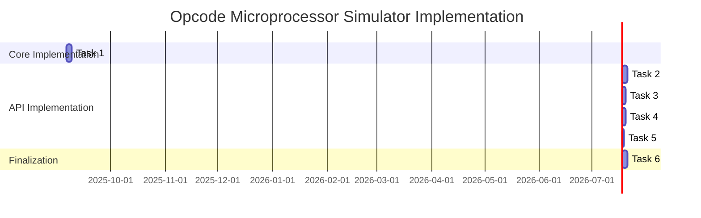

# Opcode Microprocessor Simulator - Implementation Plan

## Project Overview

The Opcode Microprocessor Simulator is a software implementation that simulates a custom microprocessor with:
- 4 registers (A, B, C, D), each storing 32-bit signed integers
- 7 instructions (SET, ADR, ADD, MOV, INR, DCR, RST)
- REST API endpoints to interact with the simulator

## Architecture Summary

The system follows a modular architecture with these key components:

1. **Register Manager**: Manages the state of registers
2. **Instruction Set**: Defines available instructions and their behavior
3. **Instruction Parser**: Parses input instructions into executable commands
4. **Instruction Executor**: Executes parsed instructions by manipulating registers
5. **REST API Layer**: Exposes functionality through RESTful endpoints

## Design Patterns

The implementation will utilize several design patterns:

1. **Command Pattern**: Each instruction is implemented as a command object
2. **Factory Pattern**: An instruction factory creates appropriate command objects
3. **Registry Pattern**: Registers are managed in a registry for easy extension
4. **Facade Pattern**: The Processor class provides a simplified interface to the system

## Implementation Tasks (API-focused)

The implementation is broken down into 6 distinct tasks that can be completed sequentially:

### Task 1: Core Domain Model Implementation
- Implement the register manager and basic exception handling
- Create the instruction interface and abstract base class
- Includes unit tests for the core components

### Task 2: Execute Single Instruction API
- Implement the instruction classes needed (SET, ADR, ADD, MOV, INR, DCR, RST)
- Create the instruction factory and parser
- Implement the processor core functionality
- Create the service method for executing a single instruction
- Implement the POST /api/v1/instructions endpoint
- Write unit and integration tests for this endpoint

### Task 3: Execute Batch Instructions API
- Build on Task 2 to implement batch execution
- Create the service method for executing multiple instructions
- Implement the POST /api/v1/instructions/batch endpoint
- Add error handling for partial execution
- Write unit and integration tests for this endpoint

### Task 4: Register Value APIs
- Implement the service methods for retrieving register values
- Create the GET /api/v1/registers endpoint for all registers
- Create the GET /api/v1/registers/{register} endpoint for specific registers
- Implement proper error handling for invalid registers
- Write unit and integration tests for these endpoints

### Task 5: Reset Processor API
- Implement the service method for resetting the processor
- Create the POST /api/v1/processor/reset endpoint
- Write unit and integration tests for this endpoint

### Task 6: API Documentation and Final Integration
- Implement Swagger/OpenAPI documentation
- Create end-to-end tests that use multiple endpoints
- Perform final validation and testing
- Ensure extensibility for future instructions and registers

## Development Approach

Each task is designed to be:
- **Self-contained**: Delivers a complete, testable API endpoint
- **Progressive**: Builds upon previous tasks
- **Focused**: Addresses a specific aspect of the system
- **Testable**: Has clear success criteria

## Timeline and Dependencies

## Extensibility Considerations

The implementation is designed to be extensible:
- New instructions can be added by creating new command classes
- New registers can be added by updating the RegisterManager
- No core changes are needed for these extensions

## Conclusion

This implementation plan provides a structured approach to developing the Opcode Microprocessor Simulator. By following the tasks in sequence, a junior developer can build the system incrementally, with each step delivering a complete API endpoint.

Detailed specifications for each task are provided in separate files in the `docs/implementation-plan/` directory.
