# Technical Specification: Opcode Microprocessor Simulator

## Document Information
- **Version**: 1.0
- **Date**: September 5, 2025
- **Status**: Draft

## Table of Contents
1. [Introduction](#1-introduction)
2. [High-Level Design](#2-high-level-design)
3. [Low-Level Design](#3-low-level-design)
4. [Extensibility Design](#4-extensibility-design)
5. [Testing Strategy](#5-testing-strategy)
6. [Implementation Plan](#6-implementation-plan)
7. [Considerations and Constraints](#7-considerations-and-constraints)
8. [Conclusion](#8-conclusion)

## 1. Introduction

### 1.1 Purpose
This document provides a comprehensive technical specification for the Opcode Microprocessor Simulator, a software implementation that simulates the behavior of a custom microprocessor with a specific instruction set.

### 1.2 Scope
The specification covers the design, architecture, implementation details, and testing strategy for the simulator. It focuses on the core logic and implementation, following best practices and ensuring extensibility for future enhancements.

### 1.3 Requirements Overview
The Opcode Microprocessor Simulator will:
- Simulate a microprocessor with 4 registers (A, B, C, D), each storing 32-bit signed integers
- Implement a specific instruction set (SET, ADR, ADD, MOV, INR, DCR, RST)
- Be implemented in Java
- Include comprehensive unit tests
- Follow best practices (SOLID, DRY)
- Be designed for extensibility

## 2. High-Level Design

### 2.1 System Overview

The Opcode Microprocessor Simulator will be a software implementation that simulates the behavior of a custom microprocessor with a specific instruction set. The system will process instructions that manipulate four 32-bit signed integer registers (A, B, C, D).

### 2.2 Architecture

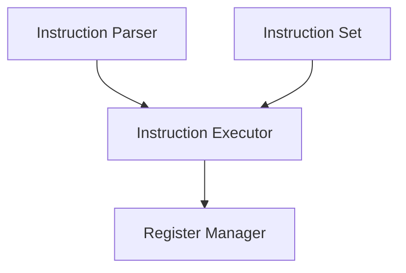

The system will follow a modular architecture with the following key components:

1. **Register Manager**: Manages the state of the microprocessor's registers.
2. **Instruction Set**: Defines the available instructions and their behavior.
3. **Instruction Parser**: Parses input instructions into executable commands.
4. **Instruction Executor**: Executes parsed instructions by manipulating registers.

### 2.3 Technology Stack

The system will be implemented in **Java** for the following reasons:
- Strong typing system helps prevent errors when dealing with register operations
- Excellent unit testing frameworks (JUnit)
- Object-oriented features support SOLID principles and extensibility
- Good performance for computational operations

### 2.4 Key Design Decisions

1. **Command Pattern**: Implement each instruction as a command object, allowing for easy extension with new instructions.
2. **Factory Pattern**: Use a factory to create appropriate command objects based on instruction input.
3. **Registry Pattern**: Implement registers as a registry that can be easily extended.
4. **Immutability**: Ensure register state changes are handled in an immutable way for predictability.
5. **Validation**: Implement robust validation for instruction syntax and register bounds.

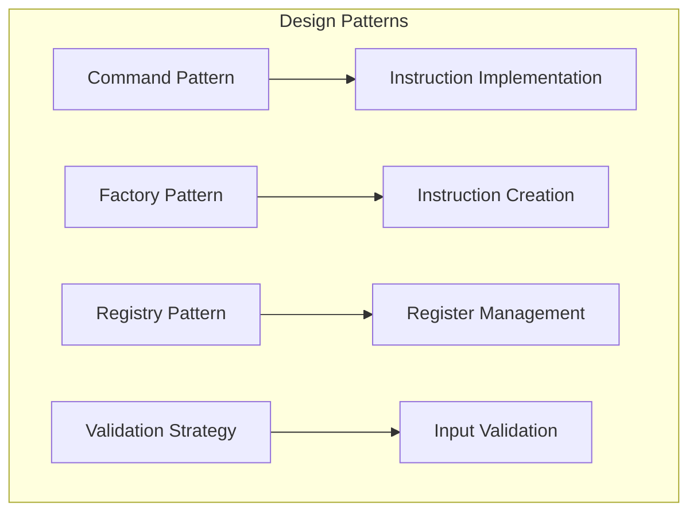

## 3. Low-Level Design

### 3.1 Core Components

#### 3.1.1 Register Manager

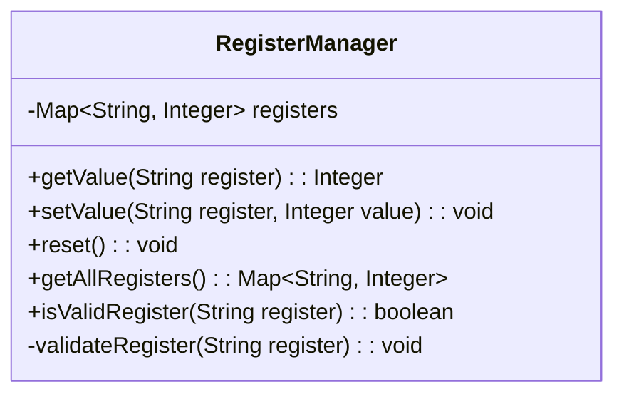

The `RegisterManager` will:
- Store the current state of all registers
- Provide methods to get and set register values
- Validate register names
- Handle the reset operation

**Implementation Details**:
```java
public class RegisterManager {
    private final Map<String, Integer> registers;
    
    public RegisterManager() {
        registers = new HashMap<>();
        // Initialize registers A, B, C, D with value 0
        registers.put("A", 0);
        registers.put("B", 0);
        registers.put("C", 0);
        registers.put("D", 0);
    }
    
    public Integer getValue(String register) {
        validateRegister(register);
        return registers.get(register);
    }
    
    public void setValue(String register, Integer value) {
        validateRegister(register);
        registers.put(register, value);
    }
    
    public void reset() {
        registers.replaceAll((k, v) -> 0);
    }
    
    public Map<String, Integer> getAllRegisters() {
        return Collections.unmodifiableMap(registers);
    }
    
    public boolean isValidRegister(String register) {
        return registers.containsKey(register);
    }
    
    private void validateRegister(String register) {
        if (!isValidRegister(register)) {
            throw new InvalidRegisterException("Invalid register: " + register);
        }
    }
}
```

#### 3.1.2 Instruction Interface

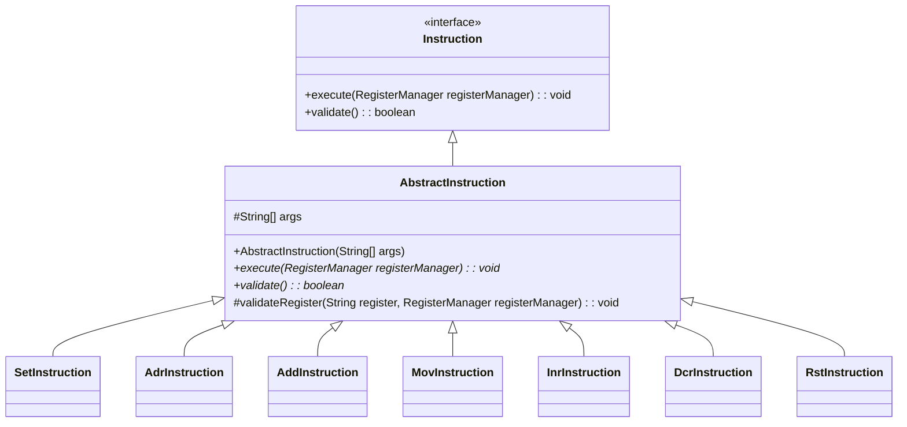

Each instruction will implement this interface with:
- An `execute` method that performs the operation on registers
- A `validate` method to ensure the instruction is valid

**Implementation Details**:
```java
public interface Instruction {
    void execute(RegisterManager registerManager);
    boolean validate();
}

// Abstract base class for common functionality
public abstract class AbstractInstruction implements Instruction {
    protected final String[] args;
    
    public AbstractInstruction(String[] args) {
        this.args = args;
    }
    
    @Override
    public abstract void execute(RegisterManager registerManager);
    
    @Override
    public abstract boolean validate();
    
    protected void validateRegister(String register, RegisterManager registerManager) {
        if (!registerManager.isValidRegister(register)) {
            throw new InvalidRegisterException("Invalid register: " + register);
        }
    }
}
```

#### 3.1.3 Instruction Parser

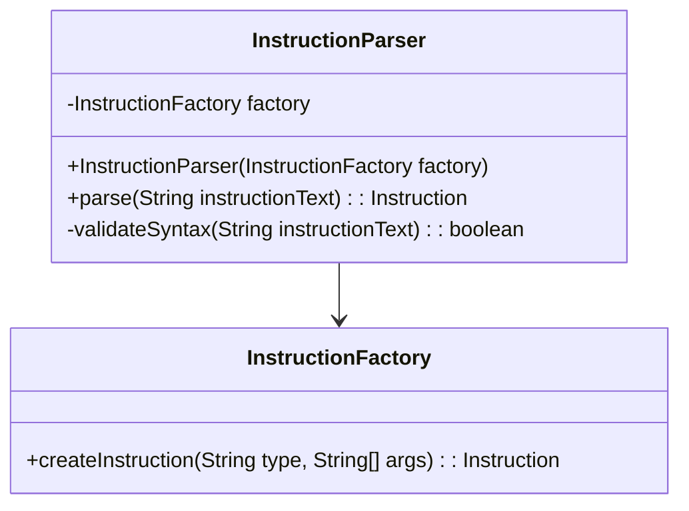

The `InstructionParser` will:
- Parse raw instruction text
- Validate syntax
- Use a factory to create the appropriate instruction object

**Implementation Details**:
```java
public class InstructionParser {
    private final InstructionFactory factory;
    
    public InstructionParser(InstructionFactory factory) {
        this.factory = factory;
    }
    
    public Instruction parse(String instructionText) {
        if (!validateSyntax(instructionText)) {
            throw new InvalidSyntaxException("Invalid instruction syntax: " + instructionText);
        }
        
        String[] parts = instructionText.trim().split("\\s+");
        String instructionType = parts[0];
        String[] args = Arrays.copyOfRange(parts, 1, parts.length);
        
        return factory.createInstruction(instructionType, args);
    }
    
    private boolean validateSyntax(String instructionText) {
        // Basic syntax validation
        if (instructionText == null || instructionText.trim().isEmpty()) {
            return false;
        }
        
        String[] parts = instructionText.trim().split("\\s+");
        if (parts.length == 0) {
            return false;
        }
        
        // Further validation can be added based on instruction type
        return true;
    }
}
```

#### 3.1.4 Instruction Factory

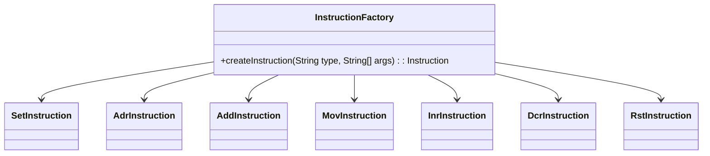

The `InstructionFactory` will:
- Create the appropriate instruction object based on the instruction type
- Handle validation of instruction arguments

**Implementation Details**:
```java
public class InstructionFactory {
    public Instruction createInstruction(String type, String[] args) {
        switch (type.toUpperCase()) {
            case "SET":
                return new SetInstruction(args);
            case "ADR":
                return new AdrInstruction(args);
            case "ADD":
                return new AddInstruction(args);
            case "MOV":
                return new MovInstruction(args);
            case "INR":
                return new InrInstruction(args);
            case "DCR":
                return new DcrInstruction(args);
            case "RST":
                return new RstInstruction(args);
            default:
                throw new InvalidInstructionException("Unknown instruction type: " + type);
        }
    }
}
```

#### 3.1.5 Processor

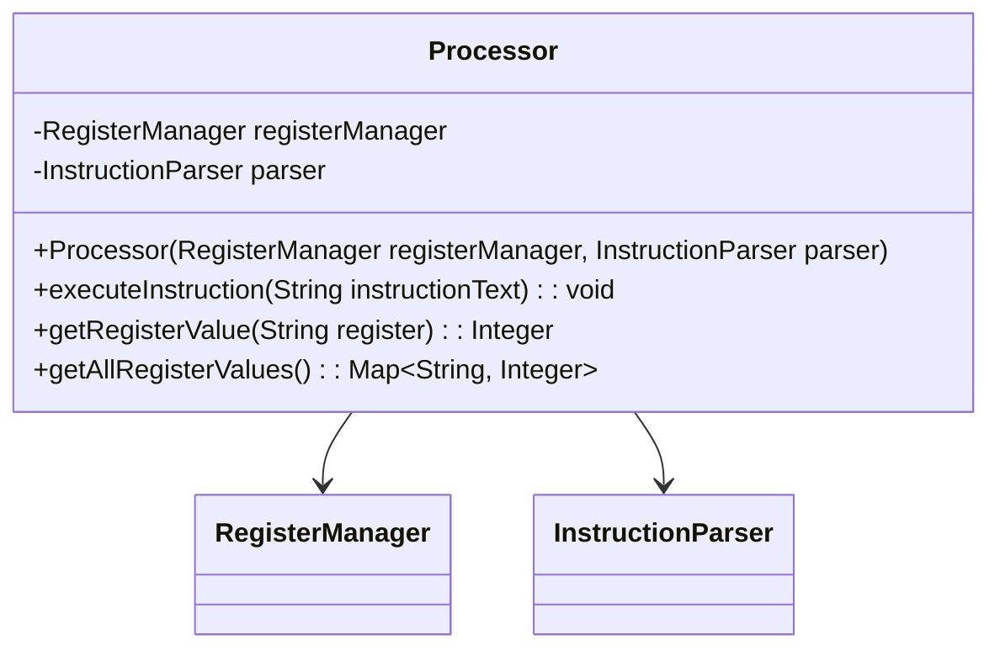

The `Processor` will:
- Act as the facade for the system
- Coordinate parsing and execution of instructions
- Provide access to register values

**Implementation Details**:
```java
public class Processor {
    private final RegisterManager registerManager;
    private final InstructionParser parser;
    
    public Processor(RegisterManager registerManager, InstructionParser parser) {
        this.registerManager = registerManager;
        this.parser = parser;
    }
    
    public void executeInstruction(String instructionText) {
        Instruction instruction = parser.parse(instructionText);
        instruction.execute(registerManager);
    }
    
    public Integer getRegisterValue(String register) {
        return registerManager.getValue(register);
    }
    
    public Map<String, Integer> getAllRegisterValues() {
        return registerManager.getAllRegisters();
    }
}
```

### 3.2 Instruction Implementations

Each instruction will be implemented as a separate class:

#### 3.2.1 SetInstruction

Sets a register to a specific value.

```java
public class SetInstruction extends AbstractInstruction {
    public SetInstruction(String[] args) {
        super(args);
    }
    
    @Override
    public void execute(RegisterManager registerManager) {
        if (!validate()) {
            throw new InvalidSyntaxException("Invalid SET instruction syntax");
        }
        
        String register = args[0];
        int value = Integer.parseInt(args[1]);
        
        registerManager.setValue(register, value);
    }
    
    @Override
    public boolean validate() {
        return args.length == 2 && args[0] != null && args[1] != null;
    }
}
```

#### 3.2.2 AdrInstruction

Adds the value of one register to another.

```java
public class AdrInstruction extends AbstractInstruction {
    public AdrInstruction(String[] args) {
        super(args);
    }
    
    @Override
    public void execute(RegisterManager registerManager) {
        if (!validate()) {
            throw new InvalidSyntaxException("Invalid ADR instruction syntax");
        }
        
        String targetRegister = args[0];
        String sourceRegister = args[1];
        
        int targetValue = registerManager.getValue(targetRegister);
        int sourceValue = registerManager.getValue(sourceRegister);
        
        registerManager.setValue(targetRegister, targetValue + sourceValue);
    }
    
    @Override
    public boolean validate() {
        return args.length == 2 && args[0] != null && args[1] != null;
    }
}
```

#### 3.2.3 AddInstruction

Adds a constant value to a register.

```java
public class AddInstruction extends AbstractInstruction {
    public AddInstruction(String[] args) {
        super(args);
    }
    
    @Override
    public void execute(RegisterManager registerManager) {
        if (!validate()) {
            throw new InvalidSyntaxException("Invalid ADD instruction syntax");
        }
        
        String register = args[0];
        int value = Integer.parseInt(args[1]);
        
        int currentValue = registerManager.getValue(register);
        registerManager.setValue(register, currentValue + value);
    }
    
    @Override
    public boolean validate() {
        return args.length == 2 && args[0] != null && args[1] != null;
    }
}
```

#### 3.2.4 MovInstruction

Copies the value from one register to another.

```java
public class MovInstruction extends AbstractInstruction {
    public MovInstruction(String[] args) {
        super(args);
    }
    
    @Override
    public void execute(RegisterManager registerManager) {
        if (!validate()) {
            throw new InvalidSyntaxException("Invalid MOV instruction syntax");
        }
        
        String targetRegister = args[0];
        String sourceRegister = args[1];
        
        int sourceValue = registerManager.getValue(sourceRegister);
        registerManager.setValue(targetRegister, sourceValue);
    }
    
    @Override
    public boolean validate() {
        return args.length == 2 && args[0] != null && args[1] != null;
    }
}
```

#### 3.2.5 InrInstruction

Increments a register by 1.

```java
public class InrInstruction extends AbstractInstruction {
    public InrInstruction(String[] args) {
        super(args);
    }
    
    @Override
    public void execute(RegisterManager registerManager) {
        if (!validate()) {
            throw new InvalidSyntaxException("Invalid INR instruction syntax");
        }
        
        String register = args[0];
        int currentValue = registerManager.getValue(register);
        registerManager.setValue(register, currentValue + 1);
    }
    
    @Override
    public boolean validate() {
        return args.length == 1 && args[0] != null;
    }
}
```

#### 3.2.6 DcrInstruction

Decrements a register by 1.

```java
public class DcrInstruction extends AbstractInstruction {
    public DcrInstruction(String[] args) {
        super(args);
    }
    
    @Override
    public void execute(RegisterManager registerManager) {
        if (!validate()) {
            throw new InvalidSyntaxException("Invalid DCR instruction syntax");
        }
        
        String register = args[0];
        int currentValue = registerManager.getValue(register);
        registerManager.setValue(register, currentValue - 1);
    }
    
    @Override
    public boolean validate() {
        return args.length == 1 && args[0] != null;
    }
}
```

#### 3.2.7 RstInstruction

Resets all registers to zero.

```java
public class RstInstruction extends AbstractInstruction {
    public RstInstruction(String[] args) {
        super(args);
    }
    
    @Override
    public void execute(RegisterManager registerManager) {
        if (!validate()) {
            throw new InvalidSyntaxException("Invalid RST instruction syntax");
        }
        
        registerManager.reset();
    }
    
    @Override
    public boolean validate() {
        return args.length == 0;
    }
}
```

### 3.3 Exception Handling

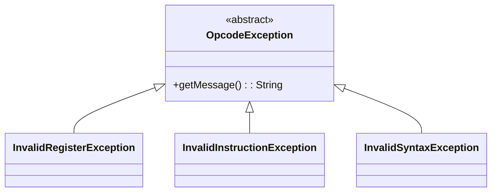

The system will use custom exceptions to handle:
- Invalid register names
- Invalid instruction types
- Invalid syntax
- Overflow/underflow conditions

### 3.4 Package Structure

```mermaid
graph TD
    A[com.opcode] --> B[core]
    A --> C[instruction]
    A --> D[parser]
    A --> E[exception]
    A --> F[util]
    
    B --> B1[Processor.java]
    B --> B2[RegisterManager.java]
    
    C --> C1[Instruction.java]
    C --> C2[AbstractInstruction.java]
    C --> C3[SetInstruction.java]
    C --> C4[AdrInstruction.java]
    C --> C5[AddInstruction.java]
    C --> C6[MovInstruction.java]
    C --> C7[InrInstruction.java]
    C --> C8[DcrInstruction.java]
    C --> C9[RstInstruction.java]
    
    D --> D1[InstructionParser.java]
    D --> D2[InstructionFactory.java]
    
    E --> E1[OpcodeException.java]
    E --> E2[InvalidRegisterException.java]
    E --> E3[InvalidInstructionException.java]
    E --> E4[InvalidSyntaxException.java]
    
    F --> F1[ValidationUtils.java]
```

## 4. Extensibility Design

### 4.1 Adding New Instructions

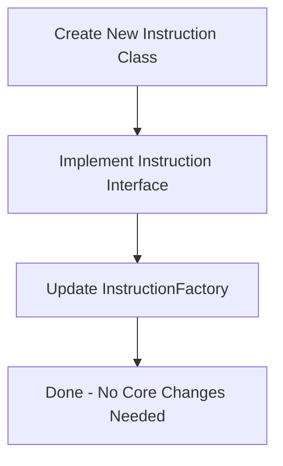

To add new instructions (like AND, OR, XOR):
1. Create a new class implementing the `Instruction` interface
2. Update the `InstructionFactory` to recognize and create the new instruction
3. No changes needed to the core processor or register manager

**Example: Adding XOR Instruction**

```java
public class XorInstruction extends AbstractInstruction {
    public XorInstruction(String[] args) {
        super(args);
    }
    
    @Override
    public void execute(RegisterManager registerManager) {
        if (!validate()) {
            throw new InvalidSyntaxException("Invalid XOR instruction syntax");
        }
        
        String targetRegister = args[0];
        String sourceRegister = args[1];
        
        int targetValue = registerManager.getValue(targetRegister);
        int sourceValue = registerManager.getValue(sourceRegister);
        
        registerManager.setValue(targetRegister, targetValue ^ sourceValue);
    }
    
    @Override
    public boolean validate() {
        return args.length == 2 && args[0] != null && args[1] != null;
    }
}
```

### 4.2 Adding New Registers

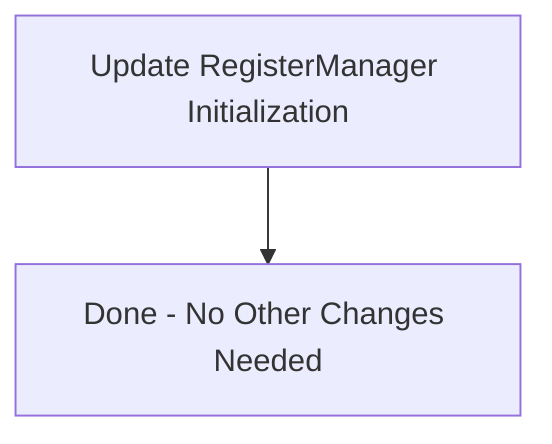

To add new registers (like E, F):
1. Update the initialization in the `RegisterManager` to include the new registers
2. No changes needed to the instruction implementations or parser

**Example: Adding Register E and F**

```java
public RegisterManager() {
    registers = new HashMap<>();
    // Initialize registers A, B, C, D, E, F with value 0
    registers.put("A", 0);
    registers.put("B", 0);
    registers.put("C", 0);
    registers.put("D", 0);
    registers.put("E", 0);
    registers.put("F", 0);
}
```

## 5. Testing Strategy

### 5.1 Unit Testing

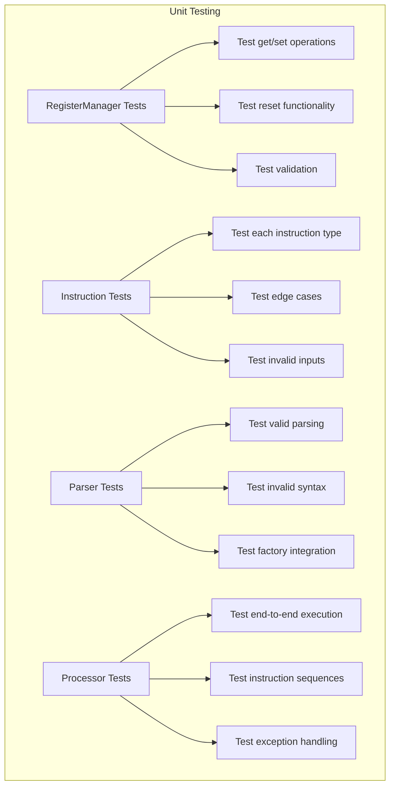

1. **RegisterManager Tests**:
   - Test get/set operations
   - Test reset functionality
   - Test validation of register names

2. **Instruction Tests**:
   - Test each instruction type individually
   - Test edge cases (min/max values, overflow)
   - Test invalid inputs

3. **Parser Tests**:
   - Test parsing of valid instructions
   - Test handling of invalid syntax
   - Test instruction factory integration

4. **Processor Tests**:
   - Test end-to-end instruction execution
   - Test sequences of instructions
   - Test exception handling

### 5.2 Integration Testing

Test complete instruction sequences to verify correct behavior of the entire system.

**Example Test Case**:
```java
@Test
public void testInstructionSequence() {
    // Arrange
    Processor processor = new Processor(new RegisterManager(), new InstructionParser(new InstructionFactory()));
    
    // Act
    processor.executeInstruction("SET A 10");
    processor.executeInstruction("SET B 20");
    processor.executeInstruction("ADR A B");
    processor.executeInstruction("INR A");
    
    // Assert
    assertEquals(31, processor.getRegisterValue("A"));
    assertEquals(20, processor.getRegisterValue("B"));
}
```

## 6. Implementation Plan

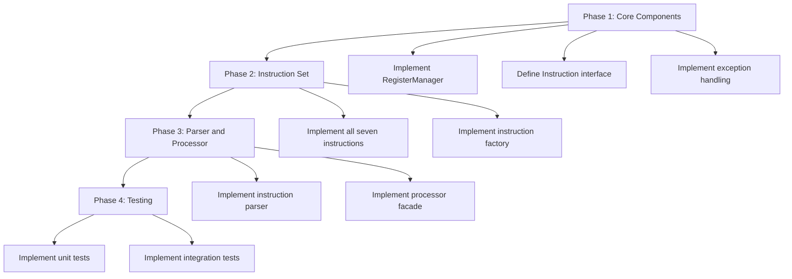

1. **Phase 1**: Core Components
   - Implement `RegisterManager`
   - Define `Instruction` interface
   - Implement basic exception handling

2. **Phase 2**: Instruction Set
   - Implement all seven instruction types
   - Implement instruction factory

3. **Phase 3**: Parser and Processor
   - Implement instruction parser
   - Implement processor facade

4. **Phase 4**: Testing
   - Implement comprehensive unit tests
   - Implement integration tests

## 7. Considerations and Constraints

### 7.1 Performance

- The system should efficiently handle instruction execution
- Consider optimizing for repeated operations

### 7.2 Error Handling

- Provide clear error messages for invalid instructions
- Handle edge cases like integer overflow/underflow

### 7.3 Maintainability

- Follow SOLID principles
- Use meaningful naming conventions
- Document code thoroughly

## 8. Conclusion

This technical specification outlines a modular, extensible design for the Opcode Microprocessor Simulator. The design follows object-oriented principles and best practices, making it easy to maintain and extend in the future.

The key strengths of this design are:
1. **Modularity**: Clear separation of concerns between components
2. **Extensibility**: Easy to add new instructions and registers
3. **Testability**: Well-defined interfaces make unit testing straightforward
4. **Maintainability**: Clean architecture and adherence to SOLID principles

The implementation will provide a solid foundation for simulating the behavior of the custom microprocessor, with room for future enhancements as needed.
