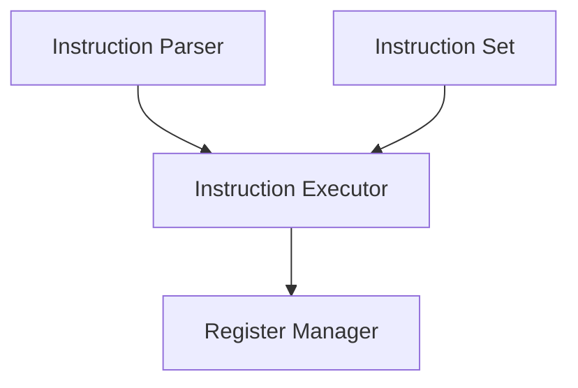
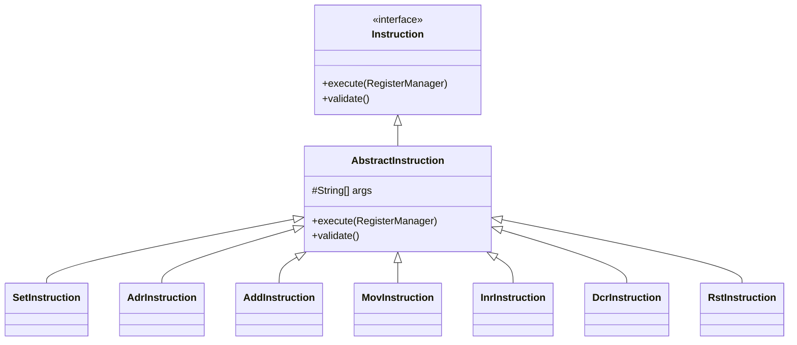
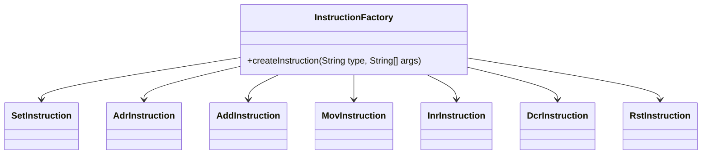
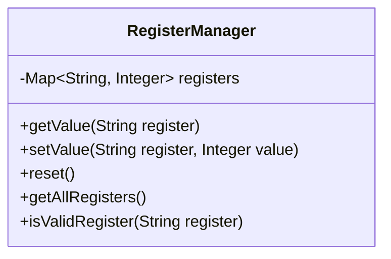
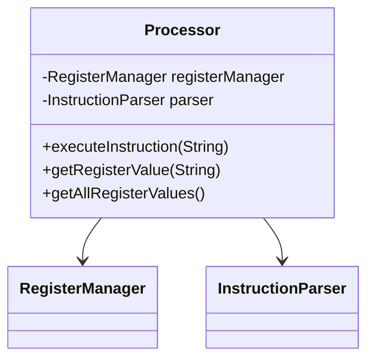
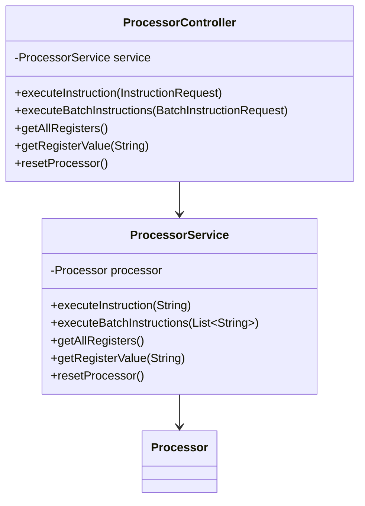
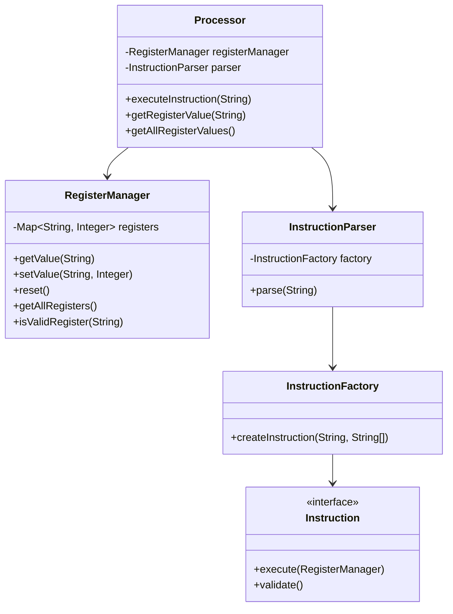
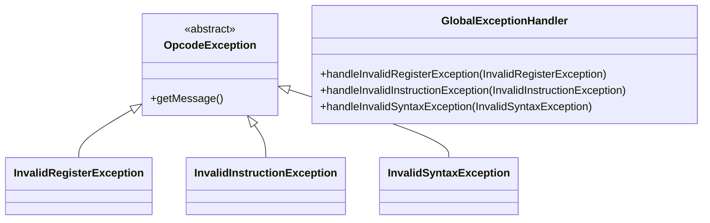

# System Patterns: Opcode Microprocessor Simulator

## System Architecture

The Opcode Microprocessor Simulator follows a modular architecture with clear separation of concerns. The system is structured around these key components:



### Core Components

1. **Register Manager**
   - Maintains the state of all registers (A, B, C, D)
   - Provides methods to get and set register values
   - Handles validation of register names
   - Implements the reset operation

2. **Instruction Interface**
   - Defines the contract for all instructions
   - Includes execute and validate methods
   - Implemented by concrete instruction classes

3. **Instruction Parser**
   - Parses raw instruction text into structured commands
   - Validates instruction syntax
   - Uses a factory to create appropriate instruction objects

4. **Instruction Factory**
   - Creates the appropriate instruction object based on instruction type
   - Handles validation of instruction arguments

5. **Processor**
   - Acts as a facade for the system
   - Coordinates parsing and execution of instructions
   - Provides access to register values

## Design Patterns

The system leverages several design patterns to ensure modularity, extensibility, and maintainability:

### 1. Command Pattern

Each instruction is implemented as a command object that encapsulates all the information needed to perform an action.



**Benefits**:
- Decouples instruction execution from the invoker
- Makes it easy to add new instructions
- Encapsulates instruction-specific logic

### 2. Factory Pattern

The `InstructionFactory` creates the appropriate instruction object based on the instruction type.



**Benefits**:
- Centralizes instruction creation logic
- Makes it easy to add new instruction types
- Encapsulates the instantiation logic

### 3. Registry Pattern

The `RegisterManager` implements a registry pattern to manage register state.



**Benefits**:
- Centralizes register state management
- Makes it easy to add new registers
- Provides a consistent interface for register operations

### 4. Facade Pattern

The `Processor` class acts as a facade, providing a simplified interface to the system.



**Benefits**:
- Simplifies the client interface
- Decouples client code from subsystem components
- Provides a single point of entry for the system

## Component Relationships

### API Layer



### Core Domain Layer



## Critical Implementation Paths

1. **Instruction Execution Flow**:
   ```
   Client → ProcessorController → ProcessorService → Processor → InstructionParser → InstructionFactory → Concrete Instruction → RegisterManager
   ```

2. **Register Value Retrieval Flow**:
   ```
   Client → ProcessorController → ProcessorService → Processor → RegisterManager
   ```

3. **Processor Reset Flow**:
   ```
   Client → ProcessorController → ProcessorService → Processor → RegisterManager
   ```

## Exception Handling



The system uses custom exceptions to handle:
- Invalid register names
- Invalid instruction types
- Invalid syntax
- Overflow/underflow conditions

These exceptions are caught by a global exception handler that returns appropriate HTTP responses.
