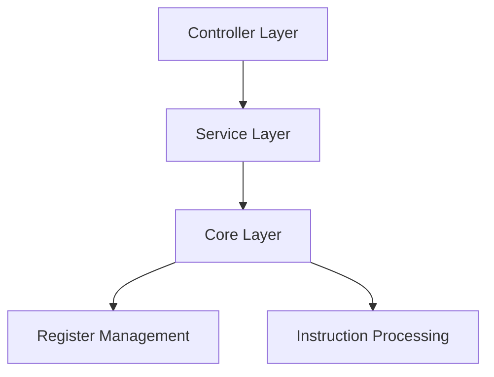
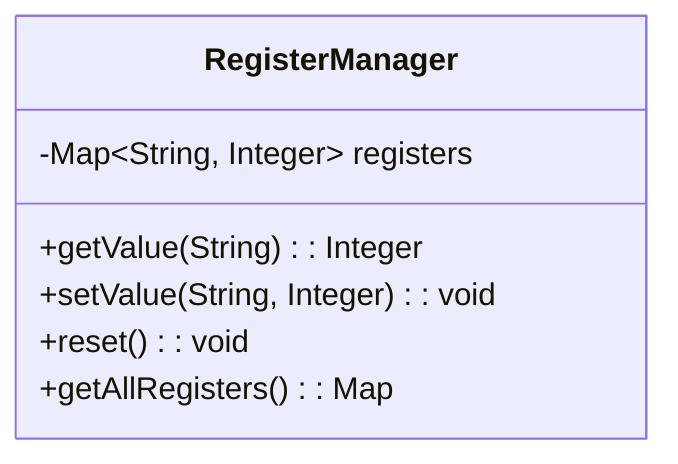
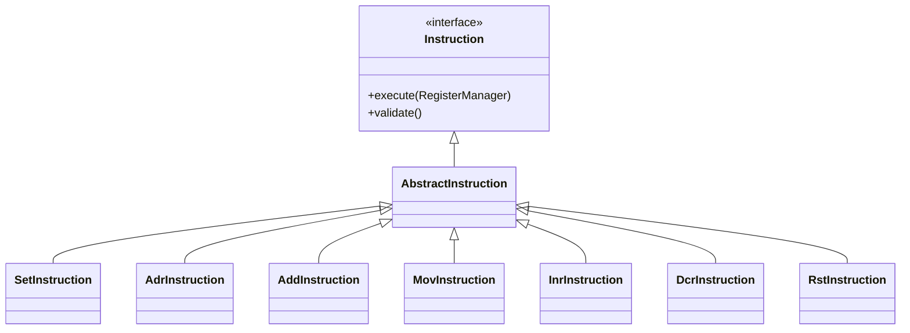
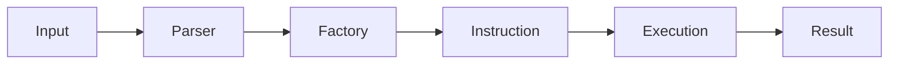
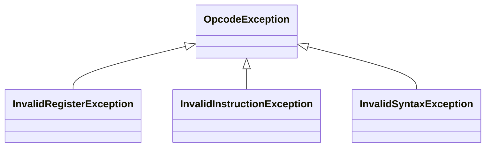
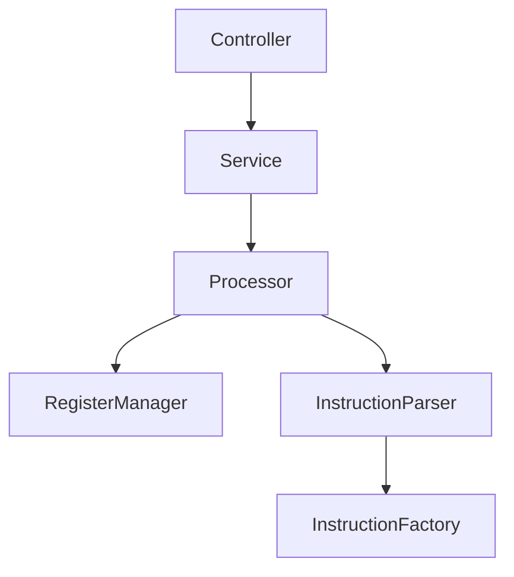

# System Patterns

## Architecture Overview



## Core Components

### 1. Register Management

- Manages register state
- Validates register operations
- Thread-safe implementation
- Immutable view of register state

### 2. Instruction Processing

- Command Pattern for instructions
- Factory Pattern for instruction creation
- Validation at instruction level
- Extensible design for new instructions

### 3. Processing Pipeline

- Clear separation of concerns
- Modular design
- Error handling at each stage
- Extensible for new features

## Design Patterns

### 1. Command Pattern
- Each instruction is a command
- Encapsulates operation details
- Consistent execution interface
- Self-contained validation

### 2. Factory Pattern
- Centralized instruction creation
- Encapsulated instantiation logic
- Easy to add new instruction types
- Consistent object creation

### 3. Facade Pattern
- Processor class as facade
- Simplifies client interaction
- Coordinates complex operations
- Hides implementation details

### 4. Registry Pattern
- RegisterManager as registry
- Centralized state management
- Controlled access to registers
- Thread-safe operations

## Error Handling

### 1. Exception Hierarchy

- Custom exceptions for different error types
- Clear error categorization
- Consistent error handling
- Informative error messages

### 2. HTTP Status Codes
- 200: Successful operation
- 400: Bad request (invalid syntax/instruction)
- 404: Not found (invalid register)
- 500: Internal server error

## API Design

### 1. REST Endpoints
```mermaid
graph TD
    A[/api/v1/instructions] --> B[Execute Single Instruction]
    B --> C[Return Register State]
```
- RESTful design principles
- Clear resource naming
- Consistent response format
- Proper HTTP method usage

### 2. Response Format
```json
{
  "status": "success|error",
  "message": "error message if applicable",
  "registers": {
    "A": 0,
    "B": 0,
    "C": 0,
    "D": 0
  }
}
```

## Testing Strategy

### 1. Unit Testing
- Individual component testing
- Mocked dependencies
- Comprehensive test cases
- Clear test organization

### 2. Integration Testing
- End-to-end flow testing
- Real component interaction
- HTTP endpoint testing
- Error scenario coverage

## Dependency Management

### 1. Spring Components

- Constructor injection
- Clear component boundaries
- Proper bean configuration
- Testable design
